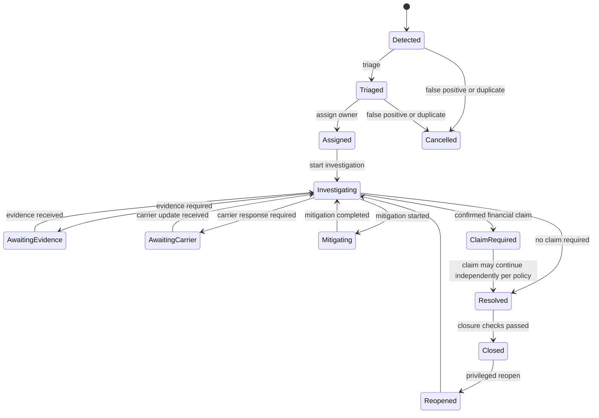
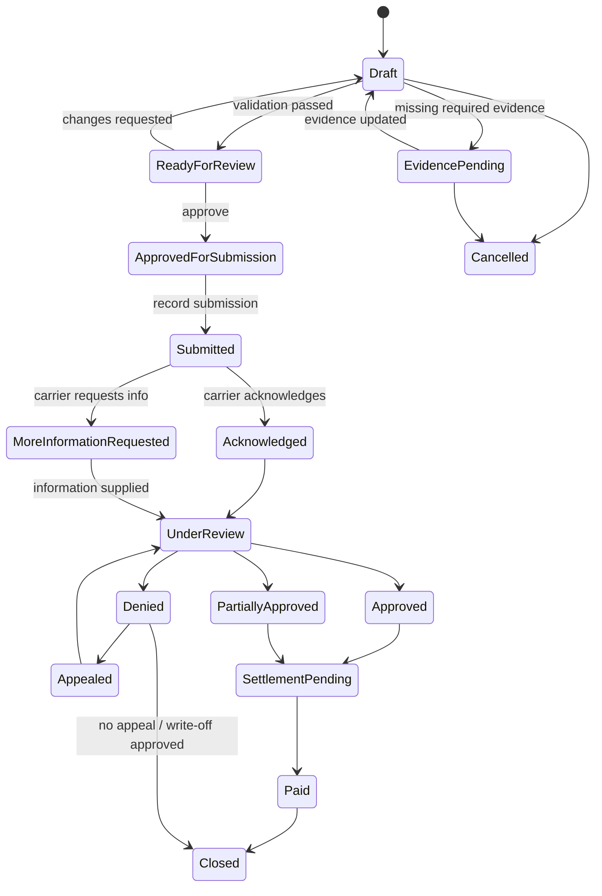

# Logistics Exception & Carrier Claims Platform

> **Master Product, Domain, Architecture and Delivery Specification for Coding Agents**

- **Working product name:** ResolveOps
- **Document type:** Product Requirements Document + Software Requirements Specification + Architecture Specification + Agent Execution Plan
- **Primary language:** English technical specification optimized for coding agents, with Vietnamese orientation and product intent
- **Target platform:** .NET 10 LTS
- **Architecture baseline:** Modular Monolith + Vertical Slice Architecture + Event-Driven Integration
- **Primary cloud:** Microsoft Azure
- **Target delivery model:** Solo developer, production-grade portfolio project, 6–12 months
- **Last reviewed:** 2026-08-05
- **Document status:** Implementation baseline v1.0

- **Language note:** The detailed engineering specification is written primarily in English to reduce ambiguity for coding agents. Product intent and user communication remain Vietnamese-first.

---

## Mục lục định hướng

- **0–3:** Quy tắc cho coding agent, tổng quan, bài toán và mục tiêu sản phẩm.
- **4–11:** Actor, thuật ngữ, phạm vi, exception taxonomy, business workflow, state machine, invariant và edge case.
- **12–15:** Kiến trúc, tech stack, cấu trúc repository, domain model và database schema.
- **16–23:** API, event contract, background job, security, observability, AI, testing, CI/CD và Azure deployment.
- **24:** Roadmap triển khai gồm 19 phase, công nghệ, task và Definition of Done cho từng phase.
- **25–37:** Coding convention, acceptance scenarios, demo data, scope control, ADR, runbook, release gate, risk và prompt khởi động agent.

> Coding agent nên bắt đầu từ **Section 0**, sau đó đọc đúng phase hiện tại trong **Section 24** cùng các section được phase đó tham chiếu.

---

## 0. Instructions for the coding agent

This document is the single source of truth for implementation unless a later Architecture Decision Record explicitly supersedes a section.

### 0.1 Mandatory operating rules

The agent MUST:

1. Read the entire current phase and all referenced sections before changing code.
2. Inspect the existing repository before creating, renaming, or deleting files.
3. Work phase by phase in the order defined in **Section 24**.
4. Keep the solution executable at the end of every phase.
5. Run build, automated tests, formatting checks, and migrations before declaring a phase complete.
6. Implement business invariants inside the domain/application layer, not only in controllers, UI, or database scripts.
7. Add tests for every state transition, authorization rule, concurrency rule, and idempotency rule introduced.
8. Record architectural deviations in `docs/adr/` before implementing them.
9. Add or update documentation whenever a public API, event contract, database schema, configuration key, or operational procedure changes.
10. Prefer explicit code over hidden conventions, reflection-heavy frameworks, or unnecessary abstractions.
11. Use UTC internally for all persisted timestamps. Convert to a user/tenant timezone only at presentation boundaries.
12. Use decimal or a Money value object for monetary data. Never use `float` or `double` for currency.
13. Treat every inbound webhook, queue message, scheduled job, and file upload as untrusted input.
14. Preserve tenant isolation in every command, query, background job, cache key, event, and storage path.
15. Use cancellation tokens for all I/O operations.
16. Use structured logs. Do not log access tokens, refresh tokens, document contents, personally identifiable information, or secrets.
17. Finish one vertical slice completely—endpoint, validation, business logic, persistence, authorization, telemetry, and tests—before opening several incomplete slices.
18. *(Added via ADR-006)* Use `string ConcurrencyStamp` instead of `long Version` for optimistic concurrency (overriding §15.1). Reflection is allowed for Auto-discovery of endpoints and handlers (overriding Rule 10).

The agent MUST NOT:

1. Convert the system into microservices during MVP.
2. Build procurement, inventory, warehouse management, route optimization, fleet management, accounting, payroll, or a general ERP.
3. Add AI before deterministic exception and claim workflows are stable.
4. let an LLM approve, reject, pay, or close a financial claim.
5. add a generic repository or generic service layer over EF Core.
6. expose EF Core entities directly from API endpoints.
7. create one shared `Common` project containing unrelated code.
8. introduce a package only because it is popular. Every package needs a clear use case.
9. silently ignore duplicate events, failed jobs, dead-letter messages, or concurrency conflicts.
10. use database transactions around slow external HTTP calls, message publication, email delivery, or AI calls.
11. add placeholder methods such as `TODO`, `NotImplementedException`, empty catch blocks, or fake success responses to pass a phase.
12. weaken tests or remove validation to make a failing implementation pass.

### 0.2 Ambiguity protocol

When a requirement is ambiguous:

1. Prefer the simplest behavior consistent with the business invariants.
2. Record the assumption in `docs/assumptions.md`.
3. Add an ADR if the assumption changes architecture, data ownership, security, or a public contract.
4. Implement the reversible option.
5. Do not block the whole phase for a minor ambiguity.

### 0.3 Required agent-maintained files

The agent must create and maintain:

```text
AGENTS.md
CHANGELOG.md
docs/
  assumptions.md
  glossary.md
  api/
  events/
  runbooks/
  adr/
  diagrams/
  test-strategy.md
  performance/
  security/
```

`AGENTS.md` must summarize:

- build and run commands;
- test commands;
- architecture constraints;
- naming rules;
- current phase;
- prohibited shortcuts;
- links to this master specification.

---

# 1. Executive summary

## 1.1 Product definition

ResolveOps is a multi-tenant operational platform that detects logistics exceptions, coordinates their resolution, gathers supporting evidence, manages carrier claims, tracks recoverable financial losses, and produces carrier performance intelligence.

It is not a Transportation Management System. It does not plan routes, dispatch vehicles, calculate driver payroll, or manage warehouse stock. It sits beside an ERP, TMS, WMS, carrier portal, or spreadsheet and manages the part that those systems usually handle poorly: abnormal situations that require human coordination, deadlines, documents, decisions, and financial recovery.

## 1.2 Core business question

For every problematic shipment, the platform must answer:

1. What happened?
2. How serious is it?
3. Which shipment, customer, carrier, leg, item, and document are affected?
4. Who owns the next action?
5. What is the SLA and deadline?
6. Which evidence is required?
7. Is a carrier claim eligible?
8. What amount is exposed, claimed, approved, denied, recovered, or written off?
9. Why was each decision made?
10. Can the entire timeline be audited later?

## 1.3 Signature project objective

The project must demonstrate the capability expected from a strong Middle .NET developer:

- business domain analysis;
- modular architecture;
- transactional consistency;
- optimistic concurrency;
- idempotent event processing;
- message queues and background workers;
- state machines and long-running workflows;
- file and document security;
- multi-tenancy;
- observability;
- performance testing;
- secure API design;
- automated testing;
- pragmatic AI integration with human approval.

---

# 2. Problem statement

## 2.1 Current operational reality

A logistics company, freight forwarder, shipper, distributor, or manufacturer may use several systems:

- ERP for orders and invoices;
- TMS for transport planning;
- carrier portals for tracking;
- email for communication;
- spreadsheets for incident lists;
- chat applications for urgent escalation;
- shared folders for POD, invoices, and damage photos.

When transport proceeds normally, these systems may be adequate. When something goes wrong, work becomes fragmented.

Typical failure pattern:

```text
Carrier sends delayed status
→ coordinator notices it late
→ information is copied to Excel
→ someone messages customer service
→ customer asks for an ETA
→ carrier asks for shipment reference
→ damage is discovered
→ photos are stored in chat
→ POD is in another mailbox
→ claim deadline is calculated manually
→ responsible employee is absent
→ evidence is incomplete
→ claim is submitted late or denied
```

## 2.2 Pain points

### Operational pain

- Exception detection depends on a person monitoring tracking screens.
- Cases have no consistent owner.
- Follow-up tasks and deadlines are lost in inboxes.
- The same incident is tracked in several tools.
- Teams cannot see which cases require immediate action.
- Out-of-order and duplicate carrier events cause confusion.
- Customers receive inconsistent updates.

### Financial pain

- Eligible claims are never submitted.
- Claims miss contractual deadlines.
- Claimed amounts are unsupported or calculated incorrectly.
- Carrier responses are not reconciled with payments or credit notes.
- Businesses cannot calculate recoverable versus unrecoverable loss.
- Duplicate claims or duplicate payments are difficult to detect.

### Compliance and audit pain

- No complete record explains who changed a status and why.
- Document versions and approval history are unclear.
- Sensitive documents are shared through insecure links.
- Carrier performance reports cannot be reproduced from source events.

### Management pain

- Management knows the number of delayed shipments but not the cost of exceptions.
- Carrier scorecards are based on opinions rather than traceable data.
- Root causes are inconsistently classified.
- SLA compliance is difficult to measure.

---

# 3. Product goals, non-goals, and success metrics

## 3.1 Product goals

The platform SHALL:

1. ingest shipments and carrier tracking events from API, webhook, and CSV;
2. normalize different carrier event formats into a canonical model;
3. detect selected exception types using versioned deterministic rules;
4. create one auditable exception case per applicable business policy;
5. assign ownership and track SLA clocks;
6. support investigation, mitigation, communication, and evidence collection;
7. determine claim readiness using configured evidence requirements;
8. manage the complete carrier claim lifecycle;
9. prevent duplicate side effects under retries and redelivery;
10. provide real-time operational dashboards and historical reports;
11. isolate tenant data securely;
12. expose integration APIs and outbound webhooks;
13. support controlled AI assistance in later versions.

## 3.2 Non-goals for MVP

The MVP SHALL NOT:

- optimize routes;
- purchase transport capacity;
- dispatch vehicles;
- manage drivers or vehicle maintenance;
- calculate freight rates for booking;
- manage warehouse inventory;
- replace ERP accounting;
- perform customs classification;
- automatically establish legal liability;
- automatically approve or pay claims;
- support every transport mode and every country-specific legal rule;
- implement microservices;
- implement a no-code workflow builder.

## 3.3 Product success metrics

MVP metrics:

- exception detection latency: under 60 seconds after a relevant event is accepted;
- duplicate carrier event side effects: zero in acceptance tests;
- open-case query p95: under 500 ms for the defined reference dataset;
- claim readiness calculation p95: under 300 ms excluding file scanning and AI;
- tenant-isolation security tests: 100% pass;
- state-transition test coverage: 100% of allowed and prohibited transitions;
- reliable audit trail for every status, ownership, SLA, evidence, and financial change;
- no critical or high-severity known security issue at release;
- reproducible local environment from a clean checkout.

Business outcome metrics supported by the product:

- average time from exception detection to assignment;
- average time to first carrier contact;
- SLA breach rate;
- claim submission rate for eligible cases;
- claim approval rate;
- recovery rate = recovered amount / claimed amount;
- preventable loss due to missed deadlines;
- exception rate by carrier, route, customer, and exception type.

---

# 4. Users, actors, and permissions

## 4.1 Primary personas

### Logistics Coordinator

Daily operational user. Reviews detected exceptions, contacts carriers, records updates, informs customers, uploads evidence, and completes tasks.

### Exception Specialist

Handles high-severity or ambiguous cases. Changes classification, investigates root cause, coordinates several teams, and recommends whether a claim is required.

### Claims Specialist

Validates eligibility, evidence, claimed amount, and deadlines. Submits claims, records carrier responses, requests additional evidence, appeals decisions, and tracks recovery.

### Customer Service Agent

Views customer-impacting cases, approved communication notes, current ETA, and resolution status. Cannot modify financial claim decisions by default.

### Warehouse Operator

Provides delivery discrepancy information, quantity confirmation, damage photos, inspection reports, and packaging evidence.

### Finance User

Validates cargo values and loss amounts, records credit notes or payments, reconciles recoveries, and closes financial settlement.

### Operations Manager

Monitors workload, SLA, case ageing, financial exposure, and carrier performance. Can reassign and escalate cases.

### Tenant Administrator

Manages tenant settings, users, roles, carriers, exception policies, evidence policies, SLA policies, integrations, and API keys.

### Carrier Contact

External restricted user or portal user. Can view explicitly shared cases, upload requested evidence, respond to claims, and view communication addressed to that carrier.

### System Worker

Non-human actor that consumes messages, detects exceptions, publishes notifications, evaluates deadlines, retries integrations, and maintains read models.

### AI Reviewer

Human role that reviews AI-extracted or AI-classified results with low confidence or high financial impact.

## 4.2 Baseline roles

```text
TenantAdmin
OperationsManager
LogisticsCoordinator
ExceptionSpecialist
ClaimsSpecialist
CustomerService
WarehouseOperator
Finance
ReadOnlyAuditor
CarrierExternal
```

## 4.3 Permission principles

- Authorization is policy-based, not only role-based.
- Every data access requires an effective tenant context.
- Financial permissions are separated from operational permissions.
- External carrier users see only cases explicitly shared with their carrier organization.
- Closed financial records require privileged reopen permissions.
- Support impersonation is not included in MVP.
- Future support impersonation must require a reason, elevated permission, short duration, and audit entry.

---

# 5. Domain glossary

| Term | Definition |
|---|---|
| Shipment | A movement of goods from an origin to a destination under one business reference. |
| Shipment Leg | One segment of a shipment handled by a carrier or transport mode. |
| Milestone | A planned or actual operational checkpoint such as pickup, hub arrival, or delivery. |
| Tracking Event | An immutable inbound fact reported by a carrier, user, device, or integration. |
| Canonical Event | A normalized event expressed in ResolveOps terminology. |
| Exception | A condition where actual or predicted shipment behavior violates a policy or expected outcome. |
| Exception Case | The auditable work item used to investigate and resolve an exception. |
| Incident | General operational occurrence. In this system, a confirmed exception is managed through an Exception Case. |
| Severity | Operational importance: Low, Medium, High, or Critical. |
| Financial Exposure | Estimated maximum financial impact before a claim decision. |
| SLA | Service-level target for acknowledgement, first action, resolution, submission, or another milestone. |
| SLA Clock | Stateful time calculation that can run, pause, resume, breach, or complete. |
| Evidence | A document, image, data record, or signed statement supporting an investigation or claim. |
| POD | Proof of Delivery. |
| BOL | Bill of Lading. |
| Claim | Formal request to a carrier for compensation or credit. |
| Claimed Amount | Amount requested from the carrier. |
| Approved Amount | Amount accepted by the carrier. |
| Recovered Amount | Amount actually received or credited. |
| Disposition | Decision describing how an exception is resolved operationally. |
| Root Cause | Classified underlying cause of the exception. |
| Mitigation | Action that reduces customer, operational, or financial impact before final resolution. |
| Carrier Scorecard | Aggregated performance and financial metrics for a carrier. |
| Tenant | An organization whose data and configuration are logically isolated. |
| Idempotency | Repeating the same request or message produces no additional business side effect. |
| Outbox | Database table containing messages committed with business data and published asynchronously. |
| Inbox | Record of consumed messages used to prevent duplicate consumer side effects. |
| Dead-letter Queue | Storage for messages that cannot be processed successfully after configured attempts. |

---

# 6. Product scope by release

## 6.1 MVP scope

MVP must support:

- tenant and user management;
- carriers and customers;
- shipment creation and CSV import;
- shipment legs and milestones;
- carrier webhook registration and event ingestion;
- canonical tracking events;
- five exception types;
- deterministic exception rules;
- exception case state machine;
- assignment and tasks;
- SLA tracking and escalation;
- comments and communication log;
- evidence metadata and file upload;
- claim eligibility and evidence checklist;
- carrier claim state machine;
- manual claim submission recording;
- carrier response recording;
- recovery and settlement recording;
- audit log;
- operational dashboard;
- basic carrier scorecard;
- outbound notifications;
- outbox/inbox and idempotency;
- production-ready tests, telemetry, security, and deployment.

## 6.2 Version 2 scope

- email ingestion;
- carrier adapter framework;
- customer and carrier external portals;
- configurable rule versioning UI;
- policy-based SLA calendars;
- partial delivery child cases;
- claim appeal workflow;
- advanced reporting with Dapper read models;
- feature flags and plan entitlements;
- richer billing/recovery reconciliation;
- document virus scan workflow;
- webhook subscription management.

## 6.3 Version 3 scope

- OCR and document extraction;
- AI email/event classification;
- AI timeline summarization with source citations;
- missing-evidence recommendations;
- semantic search;
- AI draft communication;
- human review queue;
- prompt/model versioning;
- evaluation dataset and AI quality dashboard.

## 6.4 Enterprise/SaaS scope

- SSO/OIDC/SAML integration;
- SCIM provisioning;
- advanced data retention and legal hold;
- tenant-specific encryption strategy;
- regional data residency;
- high-volume dedicated worker pools;
- self-service tenant provisioning;
- subscription and usage metering;
- enterprise audit export;
- custom carrier integrations;
- tenant branding;
- support impersonation with audit;
- disaster recovery objectives and tested failover.

---

# 7. Exception taxonomy

## 7.1 MVP exception types

### PickupDelay

The shipment or leg was not confirmed as picked up within the configured tolerance after planned pickup time.

Required core data:

- planned pickup time;
- effective timezone;
- actual pickup status;
- tolerance policy;
- carrier and leg.

### InTransitDelay

The shipment is predicted or confirmed to miss a planned transit milestone or delivery commitment.

MVP uses deterministic rules, not predictive ML.

### MissedDelivery

A delivery attempt failed or delivery was not completed by the committed time.

Common reasons:

- consignee unavailable;
- address issue;
- access denied;
- vehicle issue;
- carrier capacity;
- weather;
- unknown.

### PartialDelivery

Delivered quantity, package count, pallet count, or line quantity is below the expected quantity.

### Damage

Goods or packaging are reported as damaged, wet, crushed, broken, contaminated, tampered with, or otherwise unacceptable.

### Loss

The shipment or part of the shipment cannot be located after the configured investigation threshold.

### MissingOrInvalidDocument

Required documentation is absent, expired, inconsistent, unreadable, unsigned, or associated with the wrong shipment.

MVP implementation target may begin with five types: PickupDelay, InTransitDelay, PartialDelivery, Damage, and MissingOrInvalidDocument. Loss and MissedDelivery are activated in a later MVP phase after the common workflow is stable.

## 7.2 Severity model

Severity is calculated from configurable factors:

- customer priority;
- shipment value;
- delay duration;
- product criticality;
- temperature or safety impact;
- downstream operational impact;
- contractual penalty;
- claim deadline proximity;
- number of affected packages or units.

Baseline result:

```text
Low      = monitor; no immediate customer impact
Medium   = action required within normal operational SLA
High     = significant customer or financial impact
Critical = safety, strategic customer, major loss, or immediate escalation
```

Severity calculation must record:

- policy ID;
- policy version;
- input factors;
- calculated result;
- manual override, actor, reason, and timestamp.

---

# 8. End-to-end business workflows

## 8.1 Shipment onboarding

### Trigger

- REST API;
- CSV import;
- future ERP/TMS connector.

### Flow

1. Authenticate caller and resolve tenant.
2. Validate external reference uniqueness within tenant.
3. Validate carrier, origin, destination, dates, and declared value.
4. Create Shipment aggregate.
5. Create one or more shipment legs.
6. Create planned milestones.
7. Store source-system metadata.
8. Add `ShipmentCreated` domain event.
9. Commit shipment and outbox record atomically.
10. Return `201 Created` with resource location and ETag/version.

### Failure handling

- duplicate external reference returns `409 Conflict`;
- invalid dates return `422 Unprocessable Entity`;
- unknown carrier returns validation error or uses a controlled carrier onboarding flow;
- repeated request with the same idempotency key returns the prior outcome.

## 8.2 Tracking event ingestion

### Trigger

Carrier webhook, internal API, CSV batch, or test simulator.

### Flow

1. Validate webhook signature, timestamp, and replay window where applicable.
2. Enforce payload size and rate limits.
3. Persist raw event metadata and payload hash.
4. Resolve carrier adapter.
5. Normalize raw event to canonical event.
6. Resolve shipment and leg.
7. Build deterministic message ID.
8. Reject or quarantine unresolvable events.
9. Insert canonical tracking event as immutable data.
10. Insert inbox/idempotency record.
11. Update milestone projection if applicable.
12. Add outbox messages for downstream evaluation.
13. Commit transaction.
14. Acknowledge webhook only after durable acceptance.

### Canonical event fields

```text
EventId
TenantId
ShipmentId
ShipmentLegId?
CarrierId
ExternalEventId
EventType
EventCode
OccurredAtUtc
ReceivedAtUtc
Location
Quantity?
PackageCount?
DocumentReference?
SourceSystem
RawPayloadReference
PayloadHash
CorrelationId
CausationId
```

### Important rules

- Inbound events are immutable.
- Corrected carrier events create a new event referencing the corrected event.
- Duplicate external events must not create duplicate milestones or cases.
- Late events are accepted and evaluated against current state.
- Event occurrence time and receive time are stored separately.

## 8.3 Exception detection

### Trigger

- canonical tracking event accepted;
- scheduled deadline scan;
- shipment or policy change;
- manual detection.

### Flow

1. Load relevant shipment read model and active policy version.
2. Evaluate candidate rules.
3. Produce a structured evaluation result.
4. If no violation exists, record rule evaluation only when diagnostics require it.
5. If a violation exists, generate a deterministic exception fingerprint.
6. Check whether an active or recently closed case already represents the condition.
7. Create case or append occurrence according to policy.
8. Calculate initial severity, owner queue, SLA, and required actions.
9. Add timeline entry and domain events.
10. Commit case and outbox atomically.

### Exception fingerprint example

```text
TenantId + ShipmentId + ShipmentLegId + ExceptionType + BusinessKey + PolicyVersion
```

The fingerprint prevents repeated scans from creating duplicate active cases.

## 8.4 Triage and assignment

1. New case enters `Detected`.
2. System assigns an operational queue based on carrier, region, customer, and exception type.
3. Coordinator acknowledges the case.
4. Coordinator validates or changes exception type and severity.
5. Required tasks are generated from policy templates.
6. Owner accepts assignment.
7. Case moves to `Triaged` or `Assigned`.
8. SLA acknowledgement clock completes; resolution clock continues.

Reclassification requires:

- permission;
- reason;
- prior and new classification;
- affected SLA/evidence policy recalculation;
- audit event.

## 8.5 Investigation and mitigation

Possible actions:

- request carrier location update;
- update estimated delivery time;
- request warehouse count;
- request damage inspection;
- inform customer;
- arrange redelivery;
- preserve packaging;
- request POD;
- identify affected items;
- estimate exposure;
- classify root cause.

Every action can be represented as a task with:

```text
TaskId
CaseId
TaskType
Title
Owner
DueAtUtc
Status
CompletionEvidenceRequirement
CreatedByPolicyVersion?
CompletedAtUtc?
CompletionNote?
```

## 8.6 Evidence collection

1. User selects evidence type.
2. API creates an upload intent.
3. Authorization verifies case and tenant.
4. File metadata is validated.
5. Client uploads directly or through API depending on chosen design.
6. File enters `PendingScan`.
7. Scan worker validates content and malware result.
8. File moves to `Available`, `Rejected`, or `Quarantined`.
9. Evidence checklist is recalculated.
10. Claim readiness may change.

Evidence metadata must include:

- evidence type;
- case and claim references;
- original filename;
- safe generated storage name;
- MIME type;
- extension;
- size;
- cryptographic checksum;
- storage provider and object path;
- uploader;
- upload timestamp;
- scan status;
- document date;
- issuer;
- version;
- superseded document reference;
- access classification.

## 8.7 Claim eligibility and preparation

Claim eligibility is a deterministic result, not an LLM decision.

Inputs include:

- exception type;
- carrier contract/policy;
- claim deadline;
- shipment value;
- declared value;
- affected quantity;
- evidence checklist;
- liability exclusions;
- prior claim existence;
- operational resolution;
- currency.

Result:

```text
Eligible
ConditionallyEligible
NotEligible
InsufficientInformation
```

Every result records policy version and reason codes.

## 8.8 Claim review and submission

1. Claims Specialist creates or opens draft claim.
2. System calculates deadline and checklist.
3. User enters loss components.
4. System calculates claimed amount.
5. Validation ensures required evidence and approvals.
6. Claim moves to `ReadyForReview`.
7. Authorized reviewer approves submission.
8. Submission package is generated.
9. User submits externally or an integration sends it.
10. Submission reference and timestamp are recorded.
11. Claim moves to `Submitted`.
12. Follow-up SLA is scheduled.

## 8.9 Carrier response

Supported decisions:

- acknowledged;
- more information requested;
- approved;
- partially approved;
- denied;
- no response;
- settlement offered.

A response records:

- carrier reference;
- response date;
- decision;
- approved amount;
- reason codes;
- attached documents;
- next deadline;
- recorded by;
- source channel.

## 8.10 Recovery and financial settlement

1. Carrier approves full or partial amount.
2. Finance records expected recovery.
3. Credit note or payment is received.
4. Finance records recovery transaction.
5. System prevents duplicate transaction reference.
6. Recovered amount is recalculated.
7. Difference is classified as pending, denied, appealed, or written off.
8. Claim can close only when settlement conditions are met.

MVP does not post accounting journal entries. It stores reconciliation data and references the external finance system.

## 8.11 Case closure and reopening

Case closure requires:

- operational disposition;
- root-cause classification or approved `Unknown` reason;
- all mandatory tasks completed or waived with reason;
- claim state compatible with closure;
- customer impact note if applicable;
- final financial exposure.

Reopening requires:

- privileged permission;
- explicit reason;
- new evidence or corrected event;
- state version check;
- audit entry;
- SLA policy for reopened cases.

---

# 9. State machines

## 9.1 Exception case states



### Validity principle

No endpoint can directly set an arbitrary state. Every transition is represented by a command and protected by domain rules.

## 9.2 Claim states



## 9.3 Task states

```text
Open → InProgress → Completed
Open → Cancelled
InProgress → Blocked → InProgress
Blocked → Cancelled
```

## 9.4 SLA clock states

```text
NotStarted → Running → Completed
Running → Paused → Running
Running → Breached
Paused → Breached only when policy permits elapsed deadline while paused
```

---

# 10. Core business invariants

## 10.1 Shipment invariants

1. `ExternalReference` is unique within a tenant and source system.
2. A shipment must have at least one leg.
3. Leg sequence numbers are unique within a shipment.
4. Planned delivery cannot precede planned pickup.
5. Currency must be an allowed ISO currency for the tenant.
6. Declared value cannot be negative.
7. Shipment deletion is prohibited after tracking events exist; use cancellation or archival.
8. Completed shipment facts remain auditable.

## 10.2 Tracking invariants

1. A canonical tracking event is immutable.
2. The same tenant, carrier, and external event ID is processed once.
3. If external IDs are unreliable, payload hash and business key are used as a secondary duplicate signal.
4. A corrected event references the original event.
5. Raw payload retention follows tenant retention policy.
6. Event ordering may not be assumed globally.
7. Per-shipment processing order is used only where the integration guarantees a meaningful sequence.

## 10.3 Exception case invariants

1. An active exception fingerprint is unique.
2. A closed case cannot be modified except through a reopen transition.
3. Severity override requires reason and permission.
4. Owner changes require audit.
5. State transition must match the current version.
6. A case cannot close with mandatory incomplete tasks unless each task is waived by an authorized actor with reason.
7. A false-positive cancellation stores the policy and evidence used to make the decision.
8. Financial exposure cannot be negative.

## 10.4 Evidence invariants

1. Evidence is unavailable to business workflows until its scan status is `Available`.
2. Evidence belongs to exactly one tenant.
3. Storage object path includes a non-guessable identifier and tenant partition.
4. File extension is not trusted as MIME type.
5. A checksum is stored to identify exact duplicates.
6. Superseding a document does not erase the older version.
7. Evidence deletion follows retention policy and cannot remove a document under legal hold.
8. External carrier access requires an explicit share permission.

## 10.5 Claim invariants

1. A claim must reference an eligible exception case.
2. Claim type must be compatible with exception type.
3. Claimed amount must be positive and use one currency.
4. Approved amount cannot be negative.
5. Recovered amount cannot exceed approved amount without an explicit adjustment transaction.
6. A claim cannot be submitted without required evidence, submission approval, and a non-expired deadline unless an authorized override is recorded.
7. A submitted claim cannot silently change claimed amount; an amendment is a separate audited action.
8. A paid claim cannot return to draft.
9. A closed claim is immutable except through a privileged reopen or correction procedure.
10. External submission reference must be unique for the carrier where available.
11. Duplicate recovery transaction references are rejected.
12. AI cannot execute a financial state transition.

## 10.6 Tenant invariants

1. Every business table includes `TenantId` unless the table contains truly global static data.
2. Tenant ID is derived from trusted authentication or job context, never from arbitrary request-body values.
3. All unique business indexes include TenantId.
4. Cache keys include TenantId.
5. Blob paths include TenantId or an opaque tenant partition.
6. Events include TenantId.
7. Scheduled jobs enumerate tenants explicitly and create an isolated scope per tenant.
8. Cross-tenant administrative operations do not exist in MVP.

---

# 11. Edge cases and expected behavior

| # | Scenario | Expected behavior |
|---:|---|---|
| 1 | Carrier sends the same webhook three times | One canonical event, one milestone effect, one exception effect; repeated calls return accepted/idempotent outcome. |
| 2 | `Delivered` arrives before `OutForDelivery` | Both events persist; shipment projection reaches Delivered; late event does not regress final state. |
| 3 | Carrier corrects delivery status to failed | New correction event is stored; projection is recalculated; case may open or reopen under policy. |
| 4 | Event references unknown shipment | Event is quarantined with reason and visible in integration operations queue. |
| 5 | One shipment has several tracking numbers | Tracking aliases map to one shipment/leg without duplicate shipment creation. |
| 6 | Shipment is split across two deliveries | Partial-delivery case tracks remaining quantity; later event can resolve shortage. |
| 7 | Damage reported after clean POD | Case opens with discrepancy warning; policy requests stronger evidence and manual review. |
| 8 | Claim deadline falls on a holiday | Tenant business calendar determines the effective deadline; policy version is stored. |
| 9 | Claim currency differs from invoice currency | Conversion requires exchange-rate source, date, and audit; MVP may require manual normalized amount. |
| 10 | Same document uploaded twice | Store one or two versions per policy, but flag matching checksum and prevent duplicate checklist credit. |
| 11 | User edits a case while another user closes it | Optimistic concurrency returns 409 with current state and version. |
| 12 | SLA pauses while waiting for customer | Clock pauses only if active policy permits that waiting reason. |
| 13 | Notification sends, worker crashes before local success flag | Provider idempotency key/outbox delivery log prevents duplicate business notification where possible. |
| 14 | Queue message is redelivered | Inbox record prevents duplicate side effects. |
| 15 | Policy changes while a case is open | Existing case uses stored policy version unless an explicit migration command is approved. |
| 16 | Carrier partially approves claim | Approved portion proceeds to settlement; denied portion may be appealed or written off. |
| 17 | Finance imports the same payment twice | Unique external transaction reference rejects the second import. |
| 18 | AI output is invalid JSON | AI task fails safely, retries within policy, then moves to human review; core workflow continues. |
| 19 | Uploaded file is malicious | File remains quarantined and cannot satisfy evidence requirements. |
| 20 | User attempts cross-tenant resource ID | Return 404 or authorization-safe response without revealing resource existence. |
| 21 | Shipment times use daylight-saving timezone | Persist UTC plus source timezone; calculate local commitments through timezone-aware logic. |
| 22 | Worker processes very old event | Persist event and evaluate according to correction/late-event policy; do not discard silently. |
| 23 | Case created by scheduled scan and event simultaneously | Unique fingerprint plus transaction handling results in one active case. |
| 24 | Claim submitted one second before deadline | Use server UTC and effective policy deadline; store exact submission timestamp. |
| 25 | Carrier responds after claim was written off | Authorized user may reopen settlement workflow while retaining prior decision history. |

---

# 12. Architecture

## 12.1 Architectural style

Use a **Modular Monolith** for MVP.

Reasons:

- one developer can reason about and deploy it;
- most business actions require transactional consistency;
- module boundaries can still be explicit;
- event-driven behavior can be implemented without distributed deployment;
- the application can later extract high-load or independently governed modules;
- avoids network, deployment, testing, tracing, and data-consistency overhead of premature microservices.

## 12.2 Modules

```text
Identity
Tenancy
Partners
Shipments
Tracking
Exceptions
Workflow
Documents
Claims
Notifications
Integrations
Reporting
Audit
AI                # disabled until Version 3
```

### Identity

Users, credentials, refresh tokens, authentication, password policies, and account lifecycle.

### Tenancy

Tenant context, tenant configuration, feature entitlements, business calendar, and data-isolation services.

### Partners

Carriers, customers, warehouses, contacts, carrier service levels, and external organization access.

### Shipments

Shipment aggregate, legs, planned milestones, references, cargo summary, declared value, and lifecycle.

### Tracking

Inbound raw events, adapters, canonical events, matching, milestones, event ordering, and quarantine.

### Exceptions

Exception detection policies, cases, severity, root cause, disposition, and case timeline.

### Workflow

Assignments, tasks, SLA clocks, escalation, business calendar, and reminders.

### Documents

Evidence metadata, upload, scanning, access control, versioning, retention, and download intents.

### Claims

Eligibility, claim aggregate, loss components, evidence checklist, approvals, carrier responses, appeals, and settlement.

### Notifications

Templates, email, in-app notification, delivery attempts, preferences, and provider adapters.

### Integrations

API clients, inbound webhooks, outbound webhooks, credentials, health status, replay, and DLQ tools.

### Reporting

Operational read models, carrier scorecards, financial metrics, exports, and dashboard queries.

### Audit

Append-only audit entries and privileged audit search.

## 12.3 Dependency rules

- Modules expose contracts, not internal EF entities.
- Domain projects do not reference Infrastructure.
- Application code depends on domain abstractions and module contracts.
- Infrastructure implements persistence and external adapters.
- Cross-module writes occur through application contracts or integration events, not direct table mutation.
- Read-only reporting may use dedicated SQL projections after their ownership is documented.
- Shared building blocks are limited to technical primitives: results, clocks, IDs, domain events, tenancy context, money, and messaging envelopes.

## 12.4 Command/query model

Use Vertical Slice Architecture.

Each feature contains its endpoint, request/response contract, validation, handler, authorization requirement, mapping, and tests.

Do not require MediatR. Endpoints may resolve a feature handler directly through dependency injection. This avoids adding a mediator only for ceremony while retaining clear command/query boundaries.

Example:

```text
Modules/Claims/Features/SubmitClaim/
  SubmitClaimEndpoint.cs
  SubmitClaimCommand.cs
  SubmitClaimValidator.cs
  SubmitClaimHandler.cs
  SubmitClaimResponse.cs
  SubmitClaimAuthorization.cs
  SubmitClaimTests.cs
```

## 12.5 Transaction model

A business command owns one local database transaction.

Inside the transaction:

- load aggregate;
- validate expected version;
- execute domain behavior;
- persist aggregate changes;
- persist domain/audit records;
- insert outbox messages;
- commit.

Outside the transaction:

- send email;
- call carrier API;
- upload or scan large files;
- call AI;
- publish broker messages from outbox.

## 12.6 Event model

### Domain events

Internal facts emitted by aggregates during a transaction.

Examples:

```text
ExceptionCaseCreated
ExceptionSeverityChanged
CaseAssigned
ClaimPrepared
ClaimApprovedForSubmission
ClaimSubmitted
CarrierDecisionRecorded
RecoveryRecorded
```

### Integration events

Stable events placed in the outbox and consumed asynchronously.

Examples:

```text
ShipmentCreatedV1
TrackingEventAcceptedV1
ExceptionDetectedV1
CaseSlaBreachedV1
EvidenceAvailableV1
ClaimSubmittedV1
ClaimDecisionRecordedV1
ClaimRecoveryRecordedV1
```

Contracts are versioned. Existing consumers must not break when optional fields are added.

## 12.7 Deployment units

MVP deploys:

```text
ResolveOps.Api
ResolveOps.Worker
ResolveOps.Web (Angular SPA, served by Nginx in production)
SQL Server 2022 (Developer Edition — free; Express Edition for constrained production)
RabbitMQ 3.x (open source, Docker)
Redis 7 (open source, Docker)
MinIO (S3-compatible object storage, open source, Docker)
Seq (structured log server — free for single-server)
```

Locally, all infrastructure is orchestrated with .NET Aspire and Docker containers. No cloud account or credit is required for any phase of development.

The API and worker share module assemblies but are separate executable processes so background workloads cannot exhaust API request resources.

---

# 13. Technology stack and decision rationale

## 13.1 Backend platform

| Technology | Usage | Decision |
|---|---|---|
| .NET 10 LTS | Runtime and SDK | Long-term support baseline for a 6–12 month project. |
| ASP.NET Core Minimal APIs | HTTP endpoints | Low ceremony, explicit endpoint composition, suitable for vertical slices. |
| C# latest version supported by .NET 10 | Application language | Use nullable reference types and analyzers. |
| EF Core 10 with SQL Server provider (`Microsoft.EntityFrameworkCore.SqlServer`) | Transactional persistence | Aggregate writes, migrations, optimistic concurrency via `RowVersion`, transactional outbox. |
| Microsoft.Data.SqlClient + SQL Server 2022 | Primary relational database | Free Developer/Express editions, EF Core first-class support, `DATETIMEOFFSET`, filtered indexes, and JSON via `JSON_VALUE`/`JSON_QUERY`. |
| Dapper | Reporting queries only | Introduce after reporting queries exceed simple EF projection needs. |
| FluentValidation | Request validation | Complex validation rules with testable validators. |
| ASP.NET Core Problem Details | Error contracts | Consistent RFC-style API errors. |
| ASP.NET Core Identity | MVP user identity | Local account management without requiring an external identity platform. |
| JWT + rotating refresh tokens | SPA authentication | Short-lived access tokens and revocable sessions. |
| Microsoft Feature Management | Feature flags | Gradual activation of modules and tenant features. |

### Package version rule

Use stable packages compatible with the selected .NET SDK. Centralize versions in `Directory.Packages.props`. Do not use preview packages unless an ADR documents the need and fallback.

## 13.2 Messaging and background work

| Technology | Usage | Decision |
|---|---|---|
| RabbitMQ.Client v7 | Production broker client | Official .NET AMQP client; explicit control over exchange routing, consumer acknowledgement, and dead-letter configuration. No abstraction layer — demonstrates direct understanding of messaging patterns. |
| RabbitMQ 3.x | Message broker | Open-source, Docker-native, quorum queues for durability, dead-letter exchanges for failed messages, management UI included at no cost. |
| SQL Server Outbox table | Atomic event staging | Business data and message intent commit together in one SQL Server transaction. |
| Inbox table | Consumer idempotency | RabbitMQ at-least-once delivery does not replace receiver idempotency; inbox record in SQL Server prevents duplicate side effects. |
| BackgroundService | Outbox publisher and continuous consumers | Simple long-running host processes. |
| Quartz.NET | Scheduled scans and reminders | Persistent, clusterable schedules for SLA/deadline jobs. Introduce only when recurring jobs are required. |
| Microsoft.Extensions.Http.Resilience | External HTTP resilience | Timeouts, retry, circuit breaker, and hedging where appropriate. |

## 13.3 Storage and caching

| Technology | Usage |
|---|---|
| MinIO | Evidence files and generated claim packages. S3-compatible, open source, Docker-native. |
| AWSSDK.S3 | .NET client for MinIO (MinIO is 100% S3-API compatible; enables migration to any S3-compatible cloud without code changes). |
| Redis 7 | Distributed cache, short-lived locks only when justified, rate-limit partitions if needed, and lightweight realtime coordination. |
| StackExchange.Redis | Redis client. |

MinIO and Redis are never the source of truth for case, claim, audit, SLA, or financial state.

MinIO object paths must include a tenant partition and a non-guessable object name. Buckets are private; access is through presigned URLs with short expiry or API-proxied streaming.

## 13.4 Frontend

| Technology | Usage |
|---|---|
| Angular 19+ with TypeScript | Web application framework. Enterprise-grade, strongly typed, consistent with .NET team tooling conventions. |
| Angular CLI | Development server, build, and code generation tooling (`ng serve`, `ng build`, `ng generate`). |
| Angular HttpClient + RxJS | Server-state fetching, request caching, and real-time data streams. Use interceptors for auth headers, correlation IDs, and error normalization. |
| Angular Router | Client-side routing with lazy-loaded feature modules or standalone components. |
| Angular Material (`@angular/material`) | Consistent enterprise UI components aligned with Material Design. |
| Angular Reactive Forms | Form state, validation, and dynamic control management. |
| Zod | Client-side schema validation for UX feedback; server validation remains authoritative. |
| `@microsoft/signalr` | Real-time operational updates. Works with Angular through RxJS wrapper service. |
| Playwright | End-to-end browser tests for critical workflows. |

The frontend is intentionally thin. It must not duplicate authoritative business rules. Angular's strong typing, dependency injection, and RxJS streams suit structured enterprise data workflows.

## 13.5 Testing

| Technology | Usage |
|---|---|
| xUnit | Unit and integration tests. |
| FluentAssertions or built-in assertions | Readable test assertions; choose one and use consistently. |
| Testcontainers for .NET | SQL Server, Redis, RabbitMQ, and infrastructure integration tests. |
| Respawn | Reset relational test data where appropriate. |
| WireMock.Net | Simulated carrier, email, webhook, and external APIs. |
| Bogus | Deterministic test data builders with fixed seeds. |
| NetArchTest or architecture tests written with reflection | Enforce module and dependency rules. |
| Playwright | End-to-end browser tests for critical workflows. |
| k6 or NBomber | API load and ingestion performance tests. Choose one. |

## 13.6 Observability

| Technology | Usage |
|---|---|
| OpenTelemetry | Traces, metrics, and log correlation. |
| Serilog | Structured application logging integrated with `ILogger`. |
| .NET Aspire Service Defaults | Local telemetry and standard service configuration. |
| Aspire Dashboard | Local traces, logs, metrics, and service map. |
| Seq | Production and staging structured log server. Free for single-server deployment. Receives OTLP logs and traces from OpenTelemetry. |
| Prometheus + Grafana | Optional: production metrics dashboards if Seq alone is insufficient. Both are open-source Docker images. |
| Health Checks | Liveness, readiness, and dependency health. |

## 13.7 DevOps and infrastructure

| Technology | Usage |
|---|---|
| Docker | Reproducible application containers. |
| Docker Compose | Local and production deployment orchestration. Manages SQL Server, RabbitMQ, Redis, MinIO, Seq, Mailpit, API, Worker, and Web. |
| GitHub Actions | Build, tests, container build, security checks, and deployment. Free for public repositories. |
| GitHub Container Registry (GHCR) | Free container image registry for public repositories (`ghcr.io`). |
| Nginx | Reverse proxy, TLS termination (via Let's Encrypt/Certbot), and Angular SPA static file serving. |
| SQL Server 2022 Developer/Express Edition | Relational database. Developer Edition is free for development; Express Edition free for production (10 GB limit). |
| Redis 7 (self-hosted Docker) | Production cache and realtime coordination. |
| MinIO (self-hosted Docker) | S3-compatible object storage for evidence files and claim packages. |
| Seq (self-hosted Docker) | Structured log aggregation. Free single-server license. |

## 13.8 Explicitly rejected technologies for MVP

| Rejected choice | Reason |
|---|---|
| Microservices | Premature operational and distributed-consistency complexity. |
| Kubernetes | Excessive for solo MVP; Docker Compose on a single VPS is sufficient. |
| Event sourcing | Audit and immutable events are required, but full event sourcing adds unnecessary reconstruction and migration complexity. |
| Generic repository | Hides EF Core capabilities and creates weak abstractions. |
| AutoMapper | Explicit mapping is clearer for domain and API contracts. |
| Elasticsearch | SQL Server full-text search and projections are sufficient until measured requirements justify it. |
| Azure proprietary services (Service Bus, Blob Storage, App Insights, Key Vault, Container Apps) | Azure Student Credit exhausted; open-source stack eliminates cloud vendor cost and lock-in. |
| MassTransit or NServiceBus | Adds significant abstraction over RabbitMQ; explicit RabbitMQ.Client usage is clearer for demonstrating messaging pattern knowledge. |
| React / Vite / TanStack Query | Angular selected for alignment with .NET ecosystem conventions and enterprise tooling consistency. |
| AI agent framework in MVP | Core workflow must be deterministic and reliable first. |
| GraphQL | REST APIs are sufficient for initial operational screens. |

---

# 14. Repository and solution structure

```text
ResolveOps/
├─ AGENTS.md
├─ CHANGELOG.md
├─ README.md
├─ Directory.Build.props
├─ Directory.Packages.props
├─ global.json
├─ ResolveOps.slnx
├─ src/
│  ├─ AppHost/
│  │  └─ ResolveOps.AppHost/
│  ├─ ServiceDefaults/
│  │  └─ ResolveOps.ServiceDefaults/
│  ├─ Hosts/
│  │  ├─ ResolveOps.Api/
│  │  └─ ResolveOps.Worker/
│  ├─ BuildingBlocks/
│  │  ├─ ResolveOps.Domain/
│  │  ├─ ResolveOps.Application/
│  │  ├─ ResolveOps.Persistence/
│  │  ├─ ResolveOps.Messaging/
│  │  ├─ ResolveOps.Observability/
│  │  └─ ResolveOps.Security/
│  └─ Modules/
│     ├─ Identity/
│     ├─ Tenancy/
│     ├─ Partners/
│     ├─ Shipments/
│     ├─ Tracking/
│     ├─ Exceptions/
│     ├─ Workflow/
│     ├─ Documents/
│     ├─ Claims/
│     ├─ Notifications/
│     ├─ Integrations/
│     ├─ Reporting/
│     └─ Audit/
├─ web/
│  └─ resolveops-web/
├─ tests/
│  ├─ UnitTests/
│  ├─ IntegrationTests/
│  ├─ ArchitectureTests/
│  ├─ ContractTests/
│  ├─ EndToEndTests/
│  └─ PerformanceTests/
├─ deploy/
│  ├─ bicep/
│  ├─ docker/
│  └─ github-actions/
├─ docs/
│  ├─ adr/
│  ├─ api/
│  ├─ events/
│  ├─ diagrams/
│  ├─ runbooks/
│  ├─ security/
│  ├─ performance/
│  ├─ assumptions.md
│  ├─ glossary.md
│  └─ test-strategy.md
└─ tools/
   ├─ seed-data/
   ├─ event-simulator/
   └─ scripts/
```

## 14.1 Module internal structure

```text
ResolveOps.Modules.Exceptions/
├─ Domain/
│  ├─ ExceptionCase.cs
│  ├─ Events/
│  ├─ Policies/
│  ├─ ValueObjects/
│  └─ Errors/
├─ Application/
│  ├─ Abstractions/
│  ├─ Features/
│  ├─ Contracts/
│  └─ Mapping/
├─ Infrastructure/
│  ├─ Persistence/
│  ├─ Messaging/
│  ├─ Configuration/
│  └─ Services/
├─ Endpoints/
├─ Contracts/
└─ DependencyInjection.cs
```

A simpler folder structure is acceptable if module boundaries remain enforceable. Do not create projects for every folder if it produces excessive project count without useful compilation boundaries.

## 14.2 Build configuration

`Directory.Build.props` must enable:

```xml
<PropertyGroup>
  <TargetFramework>net10.0</TargetFramework>
  <Nullable>enable</Nullable>
  <ImplicitUsings>enable</ImplicitUsings>
  <TreatWarningsAsErrors>true</TreatWarningsAsErrors>
  <AnalysisLevel>latest-recommended</AnalysisLevel>
  <EnforceCodeStyleInBuild>true</EnforceCodeStyleInBuild>
  <Deterministic>true</Deterministic>
</PropertyGroup>
```

Exceptions to warnings-as-errors must be narrow and documented.

---

# 15. Domain model and database design

## 15.1 General database rules

- **SQL Server 2022** is the primary relational database. The EF Core SQL Server provider handles migrations and type mapping.
- Column names use **snake_case** in the schema definitions below for readability; EF Core maps C# PascalCase properties to snake_case columns via `UseSnakeCaseNamingConvention()` or explicit `HasColumnName` configuration.
- IDs use `UNIQUEIDENTIFIER` (Guid) generated application-side. Use `Guid.CreateVersion7()` (.NET 9+) for time-sortable UUIDs, or `NewSequentialId()` as a SQL Server alternative.
- All mutable aggregate roots include an explicit `version BIGINT` concurrency column (incremented on each update) or a `row_version ROWVERSION` column.
- All tenant business tables contain `tenant_id UNIQUEIDENTIFIER`.
- All timestamps use `DATETIMEOFFSET` and UTC.
- All money columns use `DECIMAL(19,4)`.
- Currency uses `NCHAR(3)` (ISO 4217 currency code).
- Soft delete is not universal. Prefer explicit business status and archival. Use soft delete only where recovery and uniqueness semantics are defined.
- Audit is append-only.
- Raw integration payloads may be stored in MinIO with database metadata when payload size or sensitivity makes database storage undesirable.

**SQL Server type mapping reference:**

| PostgreSQL type | SQL Server equivalent | Notes |
|---|---|---|
| `UUID` | `UNIQUEIDENTIFIER` | Application-generated |
| `DATETIMEOFFSET` | `DATETIMEOFFSET` | Always UTC |
| `NVARCHAR(MAX)` | `NVARCHAR(MAX)` | Add `CHECK (ISJSON(col) = 1)` constraint |
| `BOOLEAN` | `BIT` | 0/1 |
| `TEXT` | `NVARCHAR(MAX)` | Unicode |
| `VARCHAR(n)` | `NVARCHAR(n)` | Unicode |
| `CHAR(3)` | `NCHAR(3)` | |
| `DECIMAL(19,4)` | `DECIMAL(19,4)` | |
| `INTEGER` | `INT` | |
| `NVARCHAR(MAX)` (array) | `NVARCHAR(MAX)` | Store as JSON array: `["A","B"]` |
| `SMALLINT[]` (array) | `INT` bitmask or child table | e.g., working days bitmask |

**Partial unique indexes** (PostgreSQL) → **Filtered unique indexes** (SQL Server):
```sql
-- SQL Server filtered unique index equivalent
CREATE UNIQUE INDEX UIX_ExceptionCases_ActiveFingerprint
  ON exception_cases (tenant_id, fingerprint)
  WHERE status NOT IN ('Closed', 'Cancelled');
```

## 15.2 Tenant tables

### tenants

```text
id UNIQUEIDENTIFIER PK
code NVARCHAR(50) UNIQUE
name NVARCHAR(200)
status NVARCHAR(30)
default_timezone NVARCHAR(100)
default_currency NCHAR(3)
created_at_utc DATETIMEOFFSET
updated_at_utc DATETIMEOFFSET
version BIGINT
```

### tenant_settings

```text
tenant_id UNIQUEIDENTIFIER PK/FK
settings_json NVARCHAR(MAX)
updated_at_utc DATETIMEOFFSET
version BIGINT
```

Only settings without core relational integrity belong in JSON. SLA, evidence, and rule policies require versioned relational models.

### business_calendars

```text
id UNIQUEIDENTIFIER PK
tenant_id UNIQUEIDENTIFIER
name NVARCHAR(150)
timezone NVARCHAR(100)
working_days INT (bitmask: bit 0=Sunday...bit 6=Saturday) or normalized child table
working_start TIME
working_end TIME
status NVARCHAR(20)
version BIGINT
UNIQUE(tenant_id, name)
```

### business_calendar_holidays

```text
id UNIQUEIDENTIFIER PK
tenant_id UNIQUEIDENTIFIER
calendar_id UNIQUEIDENTIFIER
holiday_date DATE
name NVARCHAR(150)
is_working_override BIT
UNIQUE(tenant_id, calendar_id, holiday_date)
```

## 15.3 Identity tables

Use ASP.NET Core Identity tables with tenant-aware extensions.

Additional application tables:

### user_tenant_memberships

```text
id UNIQUEIDENTIFIER PK
user_id UNIQUEIDENTIFIER
tenant_id UNIQUEIDENTIFIER
status NVARCHAR(20)
default_role_set_id UNIQUEIDENTIFIER NULL
created_at_utc DATETIMEOFFSET
UNIQUE(user_id, tenant_id)
```

### refresh_token_sessions

```text
id UNIQUEIDENTIFIER PK
tenant_id UNIQUEIDENTIFIER
user_id UNIQUEIDENTIFIER
token_hash NVARCHAR(200)
family_id UNIQUEIDENTIFIER
issued_at_utc DATETIMEOFFSET
expires_at_utc DATETIMEOFFSET
revoked_at_utc DATETIMEOFFSET?
replaced_by_id UNIQUEIDENTIFIER NULL
created_ip_hash NVARCHAR(200)?
user_agent_hash NVARCHAR(200)?
version BIGINT
```

Store token hashes, never plaintext refresh tokens.

## 15.4 Partner tables

### carriers

```text
id UNIQUEIDENTIFIER PK
tenant_id UNIQUEIDENTIFIER
code NVARCHAR(50)
name NVARCHAR(200)
status NVARCHAR(20)
scac_or_external_code NVARCHAR(50)?
default_timezone NVARCHAR(100)?
contact_email NVARCHAR(320)?
claim_submission_channel NVARCHAR(30)
created_at_utc DATETIMEOFFSET
updated_at_utc DATETIMEOFFSET
version BIGINT
UNIQUE(tenant_id, code)
```

### customers

```text
id UNIQUEIDENTIFIER PK
tenant_id UNIQUEIDENTIFIER
code NVARCHAR(50)
name NVARCHAR(200)
priority NVARCHAR(20)
default_timezone NVARCHAR(100)?
status NVARCHAR(20)
created_at_utc DATETIMEOFFSET
updated_at_utc DATETIMEOFFSET
version BIGINT
UNIQUE(tenant_id, code)
```

### locations

```text
id UNIQUEIDENTIFIER PK
tenant_id UNIQUEIDENTIFIER
code NVARCHAR(50)
name NVARCHAR(200)
address_line_1 NVARCHAR(250)?
address_line_2 NVARCHAR(250)?
city NVARCHAR(100)?
region NVARCHAR(100)?
postal_code NVARCHAR(30)?
country_code CHAR(2)
timezone NVARCHAR(100)
latitude DECIMAL(9,6)?
longitude DECIMAL(9,6)?
UNIQUE(tenant_id, code)
```

## 15.5 Shipment tables

### shipments

```text
id UNIQUEIDENTIFIER PK
tenant_id UNIQUEIDENTIFIER
external_reference NVARCHAR(100)
source_system NVARCHAR(50)
customer_id UNIQUEIDENTIFIER
origin_location_id UNIQUEIDENTIFIER
destination_location_id UNIQUEIDENTIFIER
status NVARCHAR(30)
service_level NVARCHAR(50)?
planned_pickup_at_utc DATETIMEOFFSET
planned_delivery_at_utc DATETIMEOFFSET
actual_pickup_at_utc DATETIMEOFFSET?
actual_delivery_at_utc DATETIMEOFFSET?
declared_value DECIMAL(19,4)?
declared_value_currency NCHAR(3)?
expected_package_count INT?
expected_weight DECIMAL(18,3)?
weight_unit NVARCHAR(10)?
created_at_utc DATETIMEOFFSET
updated_at_utc DATETIMEOFFSET
version BIGINT
UNIQUE(tenant_id, source_system, external_reference)
```

### shipment_legs

```text
id UNIQUEIDENTIFIER PK
tenant_id UNIQUEIDENTIFIER
shipment_id UNIQUEIDENTIFIER
sequence_number INT
carrier_id UNIQUEIDENTIFIER
tracking_number NVARCHAR(100)?
origin_location_id UNIQUEIDENTIFIER
destination_location_id UNIQUEIDENTIFIER
planned_departure_at_utc DATETIMEOFFSET?
planned_arrival_at_utc DATETIMEOFFSET?
actual_departure_at_utc DATETIMEOFFSET?
actual_arrival_at_utc DATETIMEOFFSET?
status NVARCHAR(30)
version BIGINT
UNIQUE(tenant_id, shipment_id, sequence_number)
```

### shipment_tracking_aliases

```text
id UNIQUEIDENTIFIER PK
tenant_id UNIQUEIDENTIFIER
shipment_id UNIQUEIDENTIFIER
shipment_leg_id UNIQUEIDENTIFIER NULL
carrier_id UNIQUEIDENTIFIER
alias_type NVARCHAR(30)
alias_value NVARCHAR(150)
UNIQUE(tenant_id, carrier_id, alias_type, alias_value)
```

### shipment_items

MVP may store cargo summary only. Add line-level items if partial delivery needs precise quantity.

```text
id UNIQUEIDENTIFIER PK
tenant_id UNIQUEIDENTIFIER
shipment_id UNIQUEIDENTIFIER
line_reference NVARCHAR(100)
sku NVARCHAR(100)?
description NVARCHAR(500)?
expected_quantity DECIMAL(18,3)
quantity_unit NVARCHAR(20)
unit_value DECIMAL(19,4)?
currency NCHAR(3)?
UNIQUE(tenant_id, shipment_id, line_reference)
```

### planned_milestones

```text
id UNIQUEIDENTIFIER PK
tenant_id UNIQUEIDENTIFIER
shipment_id UNIQUEIDENTIFIER
shipment_leg_id UNIQUEIDENTIFIER NULL
milestone_type NVARCHAR(40)
planned_at_utc DATETIMEOFFSET
tolerance_minutes INT
sequence_number INT
policy_version_id UNIQUEIDENTIFIER NULL
status NVARCHAR(20)
actual_event_id UNIQUEIDENTIFIER NULL
completed_at_utc DATETIMEOFFSET?
version BIGINT
UNIQUE(tenant_id, shipment_id, shipment_leg_id, milestone_type, sequence_number)
```

## 15.6 Tracking tables

### inbound_event_receipts

```text
id UNIQUEIDENTIFIER PK
tenant_id UNIQUEIDENTIFIER
carrier_id UNIQUEIDENTIFIER NULL
source_system NVARCHAR(50)
external_event_id NVARCHAR(150)?
idempotency_key NVARCHAR(200)?
payload_hash NVARCHAR(128)
raw_payload_uri NVARCHAR(1000)?
received_at_utc DATETIMEOFFSET
signature_valid BIT?
processing_status NVARCHAR(30)
failure_code NVARCHAR(100)?
failure_detail NVARCHAR(MAX)?
correlation_id NVARCHAR(100)
UNIQUE(tenant_id, source_system, external_event_id) WHERE external_event_id IS NOT NULL
```

### tracking_events

```text
id UNIQUEIDENTIFIER PK
tenant_id UNIQUEIDENTIFIER
shipment_id UNIQUEIDENTIFIER
shipment_leg_id UNIQUEIDENTIFIER NULL
carrier_id UNIQUEIDENTIFIER
inbound_receipt_id UNIQUEIDENTIFIER
external_event_id NVARCHAR(150)?
event_type NVARCHAR(50)
event_code NVARCHAR(100)?
occurred_at_utc DATETIMEOFFSET
received_at_utc DATETIMEOFFSET
location_id UNIQUEIDENTIFIER NULL
location_text NVARCHAR(500)?
quantity DECIMAL(18,3)?
package_count INT?
correction_of_event_id UNIQUEIDENTIFIER NULL
correlation_id NVARCHAR(100)
causation_id NVARCHAR(100)?
created_at_utc DATETIMEOFFSET
```

Tracking events are insert-only for normal application permissions.

### quarantined_events

```text
id UNIQUEIDENTIFIER PK
tenant_id UNIQUEIDENTIFIER
inbound_receipt_id UNIQUEIDENTIFIER
reason_code NVARCHAR(100)
detail NVARCHAR(MAX)
status NVARCHAR(30)
assigned_user_id UNIQUEIDENTIFIER NULL
resolved_shipment_id UNIQUEIDENTIFIER NULL
resolved_at_utc DATETIMEOFFSET?
version BIGINT
```

## 15.7 Exception tables

### exception_policies

```text
id UNIQUEIDENTIFIER PK
tenant_id UNIQUEIDENTIFIER
policy_key NVARCHAR(100)
version_number INT
exception_type NVARCHAR(50)
status NVARCHAR(20)
effective_from_utc DATETIMEOFFSET
effective_to_utc DATETIMEOFFSET?
rule_definition_json NVARCHAR(MAX)
severity_definition_json NVARCHAR(MAX)
assignment_definition_json NVARCHAR(MAX)
evidence_policy_version_id UNIQUEIDENTIFIER NULL
sla_policy_version_id UNIQUEIDENTIFIER
created_by UNIQUEIDENTIFIER
created_at_utc DATETIMEOFFSET
UNIQUE(tenant_id, policy_key, version_number)
```

Rule JSON is acceptable for a controlled rule schema. It is not arbitrary executable code.

### exception_cases

```text
id UNIQUEIDENTIFIER PK
tenant_id UNIQUEIDENTIFIER
case_number NVARCHAR(40)
shipment_id UNIQUEIDENTIFIER
shipment_leg_id UNIQUEIDENTIFIER NULL
exception_type NVARCHAR(50)
fingerprint NVARCHAR(300)
status NVARCHAR(40)
severity NVARCHAR(20)
severity_score INT?
policy_id UNIQUEIDENTIFIER
policy_version_number INT
owner_user_id UNIQUEIDENTIFIER NULL
owner_team_code NVARCHAR(50)?
financial_exposure DECIMAL(19,4)
exposure_currency NCHAR(3)
root_cause_code NVARCHAR(100)?
disposition_code NVARCHAR(100)?
detected_at_utc DATETIMEOFFSET
resolved_at_utc DATETIMEOFFSET?
closed_at_utc DATETIMEOFFSET?
created_at_utc DATETIMEOFFSET
updated_at_utc DATETIMEOFFSET
version BIGINT
UNIQUE(tenant_id, case_number)
```

Use a partial unique index to prevent duplicate active fingerprints:

```text
UNIQUE INDEX UIX_ExceptionCases_ActiveFingerprint (tenant_id, fingerprint) WHERE status NOT IN ('Closed', 'Cancelled')
```

### exception_occurrences

Allows repeated related signals to attach to one case.

```text
id UNIQUEIDENTIFIER PK
tenant_id UNIQUEIDENTIFIER
case_id UNIQUEIDENTIFIER
tracking_event_id UNIQUEIDENTIFIER NULL
occurrence_type NVARCHAR(50)
observed_at_utc DATETIMEOFFSET
summary NVARCHAR(500)
```

### case_timeline_entries

```text
id UNIQUEIDENTIFIER PK
tenant_id UNIQUEIDENTIFIER
case_id UNIQUEIDENTIFIER
entry_type NVARCHAR(50)
actor_type NVARCHAR(20)
actor_id UNIQUEIDENTIFIER NULL
summary NVARCHAR(500)
details_json NVARCHAR(MAX)?
created_at_utc DATETIMEOFFSET
correlation_id NVARCHAR(100)?
```

## 15.8 Workflow tables

### workflow_tasks

```text
id UNIQUEIDENTIFIER PK
tenant_id UNIQUEIDENTIFIER
case_id UNIQUEIDENTIFIER
claim_id UNIQUEIDENTIFIER NULL
task_type NVARCHAR(50)
title NVARCHAR(250)
description NVARCHAR(MAX)?
status NVARCHAR(30)
priority NVARCHAR(20)
owner_user_id UNIQUEIDENTIFIER NULL
owner_team_code NVARCHAR(50)?
due_at_utc DATETIMEOFFSET?
blocked_reason NVARCHAR(500)?
completion_note NVARCHAR(MAX)?
completed_at_utc DATETIMEOFFSET?
created_by_policy_id UNIQUEIDENTIFIER NULL
created_at_utc DATETIMEOFFSET
updated_at_utc DATETIMEOFFSET
version BIGINT
```

### sla_policies and sla_policy_versions

```text
id UNIQUEIDENTIFIER PK
tenant_id UNIQUEIDENTIFIER
policy_key NVARCHAR(100)
name NVARCHAR(200)
```

```text
id UNIQUEIDENTIFIER PK
tenant_id UNIQUEIDENTIFIER
sla_policy_id UNIQUEIDENTIFIER
version_number INT
calendar_id UNIQUEIDENTIFIER
acknowledgement_minutes INT?
first_action_minutes INT?
resolution_minutes INT?
claim_submission_minutes INT?
pause_reason_codes NVARCHAR(MAX)
effective_from_utc DATETIMEOFFSET
status NVARCHAR(20)
UNIQUE(tenant_id, sla_policy_id, version_number)
```

### sla_clocks

```text
id UNIQUEIDENTIFIER PK
tenant_id UNIQUEIDENTIFIER
case_id UNIQUEIDENTIFIER
claim_id UNIQUEIDENTIFIER NULL
clock_type NVARCHAR(40)
policy_version_id UNIQUEIDENTIFIER
status NVARCHAR(20)
started_at_utc DATETIMEOFFSET?
due_at_utc DATETIMEOFFSET?
paused_at_utc DATETIMEOFFSET?
total_paused_seconds BIGINT
completed_at_utc DATETIMEOFFSET?
breached_at_utc DATETIMEOFFSET?
version BIGINT
```

### sla_clock_pauses

```text
id UNIQUEIDENTIFIER PK
tenant_id UNIQUEIDENTIFIER
sla_clock_id UNIQUEIDENTIFIER
reason_code NVARCHAR(100)
started_at_utc DATETIMEOFFSET
ended_at_utc DATETIMEOFFSET?
started_by UNIQUEIDENTIFIER NULL
ended_by UNIQUEIDENTIFIER NULL
```

## 15.9 Document tables

### evidence_documents

```text
id UNIQUEIDENTIFIER PK
tenant_id UNIQUEIDENTIFIER
case_id UNIQUEIDENTIFIER
claim_id UNIQUEIDENTIFIER NULL
evidence_type NVARCHAR(50)
status NVARCHAR(30)
original_file_name NVARCHAR(255)
storage_object_name NVARCHAR(500)
storage_container NVARCHAR(100)
content_type NVARCHAR(150)
size_bytes BIGINT
sha256 NVARCHAR(64)
document_date DATE?
issuer NVARCHAR(250)?
version_number INT
supersedes_document_id UNIQUEIDENTIFIER NULL
uploaded_by UNIQUEIDENTIFIER
uploaded_at_utc DATETIMEOFFSET
scan_status NVARCHAR(30)
scan_completed_at_utc DATETIMEOFFSET?
retention_until DATE?
legal_hold BIT
version BIGINT
```

### evidence_requirements

```text
id UNIQUEIDENTIFIER PK
tenant_id UNIQUEIDENTIFIER
policy_version_id UNIQUEIDENTIFIER
exception_type NVARCHAR(50)
claim_type NVARCHAR(50)?
evidence_type NVARCHAR(50)
is_mandatory BIT
condition_json NVARCHAR(MAX)?
```

## 15.10 Claim tables

### claims

```text
id UNIQUEIDENTIFIER PK
tenant_id UNIQUEIDENTIFIER
claim_number NVARCHAR(40)
case_id UNIQUEIDENTIFIER
carrier_id UNIQUEIDENTIFIER
claim_type NVARCHAR(50)
status NVARCHAR(40)
eligibility_status NVARCHAR(30)
eligibility_reason_codes NVARCHAR(MAX)
policy_version_id UNIQUEIDENTIFIER
claim_deadline_at_utc DATETIMEOFFSET
claimed_amount DECIMAL(19,4)
approved_amount DECIMAL(19,4)
recovered_amount DECIMAL(19,4)
currency NCHAR(3)
external_submission_reference NVARCHAR(150)?
submitted_at_utc DATETIMEOFFSET?
approved_for_submission_by UNIQUEIDENTIFIER NULL
approved_for_submission_at_utc DATETIMEOFFSET?
closed_at_utc DATETIMEOFFSET?
created_at_utc DATETIMEOFFSET
updated_at_utc DATETIMEOFFSET
version BIGINT
UNIQUE(tenant_id, claim_number)
```

### claim_loss_components

```text
id UNIQUEIDENTIFIER PK
tenant_id UNIQUEIDENTIFIER
claim_id UNIQUEIDENTIFIER
component_type NVARCHAR(50)
description NVARCHAR(500)
quantity DECIMAL(18,3)?
unit_amount DECIMAL(19,4)?
amount DECIMAL(19,4)
currency NCHAR(3)
source_document_id UNIQUEIDENTIFIER NULL
```

### claim_approvals

```text
id UNIQUEIDENTIFIER PK
tenant_id UNIQUEIDENTIFIER
claim_id UNIQUEIDENTIFIER
approval_type NVARCHAR(40)
status NVARCHAR(20)
requested_by UNIQUEIDENTIFIER
requested_at_utc DATETIMEOFFSET
decided_by UNIQUEIDENTIFIER NULL
decided_at_utc DATETIMEOFFSET?
decision_note NVARCHAR(MAX)?
claim_version BIGINT
```

### carrier_claim_responses

```text
id UNIQUEIDENTIFIER PK
tenant_id UNIQUEIDENTIFIER
claim_id UNIQUEIDENTIFIER
response_type NVARCHAR(50)
carrier_reference NVARCHAR(150)?
response_at_utc DATETIMEOFFSET
approved_amount DECIMAL(19,4)?
currency NCHAR(3)?
reason_codes NVARCHAR(MAX)
notes NVARCHAR(MAX)?
recorded_by UNIQUEIDENTIFIER
source_channel NVARCHAR(30)
created_at_utc DATETIMEOFFSET
```

### recovery_transactions

```text
id UNIQUEIDENTIFIER PK
tenant_id UNIQUEIDENTIFIER
claim_id UNIQUEIDENTIFIER
transaction_type NVARCHAR(30)
external_reference NVARCHAR(150)
amount DECIMAL(19,4)
currency NCHAR(3)
received_at_utc DATETIMEOFFSET
recorded_by UNIQUEIDENTIFIER
notes NVARCHAR(1000)?
UNIQUE(tenant_id, external_reference)
```

## 15.11 Messaging tables

### outbox_messages

```text
id UNIQUEIDENTIFIER PK
tenant_id UNIQUEIDENTIFIER NULL
event_type NVARCHAR(200)
event_version INT
payload NVARCHAR(MAX)
occurred_at_utc DATETIMEOFFSET
correlation_id NVARCHAR(100)
causation_id NVARCHAR(100)?
partition_key NVARCHAR(150)?
processing_status NVARCHAR(20)
processing_attempts INT
next_attempt_at_utc DATETIMEOFFSET?
processed_at_utc DATETIMEOFFSET?
last_error NVARCHAR(MAX)?
```

Index:

```text
(processing_status, next_attempt_at_utc, occurred_at_utc)
```

### inbox_messages

```text
consumer_name NVARCHAR(150)
message_id NVARCHAR(200)
tenant_id UNIQUEIDENTIFIER NULL
received_at_utc DATETIMEOFFSET
processed_at_utc DATETIMEOFFSET?
result_hash NVARCHAR(128)?
PRIMARY KEY(consumer_name, message_id)
```

### idempotency_records

```text
tenant_id UNIQUEIDENTIFIER
scope NVARCHAR(100)
idempotency_key NVARCHAR(200)
request_hash NVARCHAR(128)
response_status INT
response_body NVARCHAR(MAX)?
resource_id UNIQUEIDENTIFIER NULL
created_at_utc DATETIMEOFFSET
expires_at_utc DATETIMEOFFSET
PRIMARY KEY(tenant_id, scope, idempotency_key)
```

If the same key is reused with a different request hash, return `409 Conflict`.

## 15.12 Audit tables

### audit_entries

```text
id UNIQUEIDENTIFIER PK
tenant_id UNIQUEIDENTIFIER
occurred_at_utc DATETIMEOFFSET
actor_type NVARCHAR(20)
actor_id UNIQUEIDENTIFIER NULL
action NVARCHAR(100)
entity_type NVARCHAR(100)
entity_id UNIQUEIDENTIFIER
entity_version BIGINT?
correlation_id NVARCHAR(100)
source_ip_hash NVARCHAR(200)?
reason NVARCHAR(1000)?
changes NVARCHAR(MAX)?
metadata NVARCHAR(MAX)?
```

Audit entries are append-only for application users.

## 15.13 Important indexes

```text
exception_cases(tenant_id, status, severity, detected_at_utc DESC)
exception_cases(tenant_id, owner_user_id, status, updated_at_utc DESC)
exception_cases(tenant_id, shipment_id, detected_at_utc DESC)
claims(tenant_id, status, claim_deadline_at_utc)
claims(tenant_id, carrier_id, status, submitted_at_utc DESC)
workflow_tasks(tenant_id, owner_user_id, status, due_at_utc)
tracking_events(tenant_id, shipment_id, occurred_at_utc, id)
tracking_events(tenant_id, carrier_id, external_event_id)
case_timeline_entries(tenant_id, case_id, created_at_utc, id)
evidence_documents(tenant_id, case_id, evidence_type, status)
outbox_messages(processing_status, next_attempt_at_utc, occurred_at_utc)
audit_entries(tenant_id, entity_type, entity_id, occurred_at_utc DESC)
```

Every index must be justified by a query or constraint. The performance report must show actual execution plans for major dashboard queries.

---

# 16. API specification

## 16.1 API conventions

Base path:

```text
/api/v1
```

Headers:

```text
Authorization: Bearer <access-token>
X-Correlation-Id: optional client correlation ID
Idempotency-Key: required for selected create/submit endpoints
If-Match: expected aggregate version or ETag for concurrent updates
```

Response conventions:

- `200 OK` for successful query/update with body;
- `201 Created` for resource creation;
- `202 Accepted` for durable asynchronous acceptance;
- `204 No Content` for successful action without response body;
- `400 Bad Request` for malformed syntax;
- `401 Unauthorized` for missing/invalid authentication;
- `403 Forbidden` for known identity without permission;
- `404 Not Found` without leaking cross-tenant existence;
- `409 Conflict` for version, uniqueness, idempotency-key reuse, or invalid current state;
- `422 Unprocessable Entity` for semantic validation/business precondition failure;
- `429 Too Many Requests` for rate limits;
- `503 Service Unavailable` when a required dependency is unavailable and request cannot be durably accepted.

Problem details extension fields:

```json
{
  "type": "https://resolveops.dev/errors/concurrency-conflict",
  "title": "The resource changed before this request was applied.",
  "status": 409,
  "code": "CONCURRENCY_CONFLICT",
  "traceId": "...",
  "correlationId": "...",
  "errors": [],
  "currentVersion": 12
}
```

Pagination:

- cursor pagination for timelines and large operational lists;
- offset pagination permitted only for small administration lists;
- maximum page size 100 unless a specific export endpoint is used.

Filtering:

- allowlisted fields only;
- server-defined sort fields;
- no arbitrary SQL-like filter language in MVP.

## 16.2 Authentication endpoints

```text
POST /auth/login
POST /auth/refresh
POST /auth/logout
GET  /auth/me
POST /auth/change-password
```

Security rules:

- login response includes short-lived access token and refresh token according to selected delivery strategy;
- refresh token rotation invalidates the used token;
- reuse of an old token revokes the token family;
- login and refresh endpoints use strict rate limits;
- audit successful and failed privileged authentication events without logging passwords/tokens.

## 16.3 Tenant administration

```text
GET  /tenant
PATCH /tenant
GET  /tenant/settings
PATCH /tenant/settings
GET  /tenant/business-calendars
POST /tenant/business-calendars
PUT  /tenant/business-calendars/{calendarId}
GET  /tenant/users
POST /tenant/users/invitations
PUT  /tenant/users/{userId}/roles
POST /tenant/users/{userId}/deactivate
```

## 16.4 Partner endpoints

```text
GET  /carriers
POST /carriers
GET  /carriers/{carrierId}
PUT  /carriers/{carrierId}
POST /carriers/{carrierId}/activate
POST /carriers/{carrierId}/deactivate

GET  /customers
POST /customers
GET  /customers/{customerId}
PUT  /customers/{customerId}
```

## 16.5 Shipment endpoints

```text
POST /shipments
GET  /shipments
GET  /shipments/{shipmentId}
GET  /shipments/{shipmentId}/timeline
POST /shipments/{shipmentId}/cancel
POST /shipments/imports
GET  /shipments/imports/{importId}
GET  /shipments/{shipmentId}/tracking-events
```

### Create shipment request

```json
{
  "externalReference": "SHP-2026-000123",
  "sourceSystem": "MANUAL",
  "customerId": "uuid",
  "originLocationId": "uuid",
  "destinationLocationId": "uuid",
  "plannedPickupAt": "2026-08-10T01:00:00Z",
  "plannedDeliveryAt": "2026-08-11T10:00:00Z",
  "declaredValue": {
    "amount": 125000000.00,
    "currency": "VND"
  },
  "expectedPackageCount": 24,
  "legs": [
    {
      "sequenceNumber": 1,
      "carrierId": "uuid",
      "trackingNumber": "VN123456789",
      "originLocationId": "uuid",
      "destinationLocationId": "uuid",
      "plannedDepartureAt": "2026-08-10T01:00:00Z",
      "plannedArrivalAt": "2026-08-11T10:00:00Z"
    }
  ]
}
```

### Shipment detail response

Must include:

- current version/ETag;
- planned and actual milestones;
- current status;
- active exceptions summary;
- tracking aliases;
- financial values authorized for the caller;
- links or IDs for related resources, not embedded unlimited histories.

## 16.6 Tracking ingestion endpoints

```text
POST /integrations/carriers/{carrierCode}/webhooks/tracking
POST /tracking-events
GET  /integration-operations/quarantined-events
GET  /integration-operations/quarantined-events/{id}
POST /integration-operations/quarantined-events/{id}/resolve
POST /integration-operations/quarantined-events/{id}/reprocess
```

Webhook response should be fast and durable:

- `202 Accepted` when receipt is persisted for async normalization;
- `200/204` when synchronous durable normalization is intentionally selected;
- do not wait for exception workflows, notifications, or AI.

## 16.7 Exception endpoints

```text
GET  /exceptions
GET  /exceptions/{caseId}
GET  /exceptions/{caseId}/timeline
POST /exceptions/{caseId}/triage
POST /exceptions/{caseId}/assign
POST /exceptions/{caseId}/start-investigation
POST /exceptions/{caseId}/change-severity
POST /exceptions/{caseId}/reclassify
POST /exceptions/{caseId}/add-occurrence
POST /exceptions/{caseId}/record-carrier-update
POST /exceptions/{caseId}/start-mitigation
POST /exceptions/{caseId}/complete-mitigation
POST /exceptions/{caseId}/mark-claim-required
POST /exceptions/{caseId}/resolve
POST /exceptions/{caseId}/close
POST /exceptions/{caseId}/reopen
POST /exceptions/{caseId}/cancel
POST /exceptions/{caseId}/comments
```

### Assign case request

```json
{
  "ownerUserId": "uuid",
  "ownerTeamCode": "CLAIMS-NORTH",
  "reason": "High-value damage case requires claims specialist.",
  "expectedVersion": 4
}
```

### Change severity request

```json
{
  "severity": "Critical",
  "reasonCode": "STRATEGIC_CUSTOMER",
  "reason": "Customer production line is blocked.",
  "expectedVersion": 5
}
```

## 16.8 Task endpoints

```text
GET  /tasks/my
GET  /exceptions/{caseId}/tasks
POST /exceptions/{caseId}/tasks
POST /tasks/{taskId}/assign
POST /tasks/{taskId}/start
POST /tasks/{taskId}/block
POST /tasks/{taskId}/unblock
POST /tasks/{taskId}/complete
POST /tasks/{taskId}/cancel
```

## 16.9 Evidence endpoints

```text
GET  /exceptions/{caseId}/evidence
POST /exceptions/{caseId}/evidence/upload-intents
POST /evidence/{documentId}/complete-upload
GET  /evidence/{documentId}
POST /evidence/{documentId}/download-intent
POST /evidence/{documentId}/supersede
POST /evidence/{documentId}/remove
GET  /claims/{claimId}/evidence-checklist
```

Direct blob URLs must not be returned as permanent public URLs. Return short-lived authorized download intent or stream through an authorized endpoint.

### Upload-intent request

```json
{
  "evidenceType": "DamagePhotos",
  "fileName": "damaged-pallet-01.jpg",
  "contentType": "image/jpeg",
  "sizeBytes": 2840123,
  "sha256": "..."
}
```

### Upload-intent response

```json
{
  "documentId": "uuid",
  "uploadMethod": "SignedUrl",
  "uploadUrl": "short-lived-url",
  "expiresAt": "2026-08-05T16:00:00Z",
  "requiredHeaders": {
    "x-ms-blob-type": "BlockBlob"
  }
}
```

## 16.10 Claim endpoints

```text
POST /exceptions/{caseId}/claims
GET  /claims
GET  /claims/{claimId}
GET  /claims/{claimId}/timeline
POST /claims/{claimId}/loss-components
PUT  /claims/{claimId}/loss-components/{componentId}
DELETE /claims/{claimId}/loss-components/{componentId}
POST /claims/{claimId}/calculate-eligibility
POST /claims/{claimId}/request-review
POST /claims/{claimId}/approve-for-submission
POST /claims/{claimId}/return-to-draft
POST /claims/{claimId}/record-submission
POST /claims/{claimId}/record-acknowledgement
POST /claims/{claimId}/record-information-request
POST /claims/{claimId}/supply-additional-information
POST /claims/{claimId}/record-decision
POST /claims/{claimId}/appeal
POST /claims/{claimId}/record-recovery
POST /claims/{claimId}/write-off
POST /claims/{claimId}/close
POST /claims/{claimId}/cancel
```

### Create claim request

```json
{
  "claimType": "CargoDamage",
  "currency": "VND",
  "policyId": "uuid",
  "expectedCaseVersion": 9
}
```

### Record decision request

```json
{
  "decision": "PartiallyApproved",
  "carrierReference": "CLM-CARRIER-90872",
  "responseAt": "2026-08-18T04:15:00Z",
  "approvedAmount": {
    "amount": 8200000,
    "currency": "VND"
  },
  "reasonCodes": ["DEPRECIATION_APPLIED", "PACKAGING_EXCLUSION"],
  "notes": "Carrier approved product value but excluded repacking cost.",
  "expectedVersion": 14
}
```

### Record recovery request

```json
{
  "transactionType": "CreditNote",
  "externalReference": "CN-2026-00991",
  "amount": {
    "amount": 8200000,
    "currency": "VND"
  },
  "receivedAt": "2026-08-25T02:00:00Z",
  "notes": "Credit note posted in ERP.",
  "expectedVersion": 16
}
```

## 16.11 Policy endpoints

```text
GET  /policies/exceptions
POST /policies/exceptions
GET  /policies/exceptions/{policyId}/versions
POST /policies/exceptions/{policyId}/versions
POST /policies/exceptions/{policyId}/versions/{version}/activate
POST /policies/exceptions/{policyId}/versions/{version}/retire

GET  /policies/sla
POST /policies/sla
POST /policies/sla/{policyId}/versions

GET  /policies/evidence
POST /policies/evidence
POST /policies/evidence/{policyId}/versions
```

Policy versions are immutable after activation. Changes create a new version.

## 16.12 Reporting endpoints

```text
GET /dashboard/operations
GET /dashboard/claims
GET /reports/exception-ageing
GET /reports/sla-performance
GET /reports/carrier-scorecards
GET /reports/financial-recovery
POST /exports/exception-cases
GET /exports/{exportId}
```

Large exports are asynchronous and stored temporarily in Blob Storage with authorized download.

## 16.13 Audit endpoints

```text
GET /audit/entities/{entityType}/{entityId}
GET /audit/search
```

Audit search requires privileged permission and strict limits.

---

# 17. Event contracts and messaging design

## 17.1 Standard envelope

```json
{
  "messageId": "uuid-or-stable-string",
  "messageType": "resolveops.exceptions.exception-detected",
  "messageVersion": 1,
  "tenantId": "uuid",
  "occurredAtUtc": "2026-08-05T12:00:00Z",
  "correlationId": "uuid",
  "causationId": "uuid-or-null",
  "partitionKey": "shipment-uuid",
  "producer": "ResolveOps.Api",
  "payload": {}
}
```

## 17.2 Message ID rules

- Domain-generated integration event: event UUID.
- Retriable outbound action: stable ID derived from outbox message ID.
- Carrier receipt: tenant + carrier + external event ID where trustworthy.
- Scheduled evaluation: stable business key plus schedule occurrence.

## 17.3 Core integration events

### TrackingEventAcceptedV1

```json
{
  "trackingEventId": "uuid",
  "shipmentId": "uuid",
  "shipmentLegId": "uuid",
  "carrierId": "uuid",
  "eventType": "Delivered",
  "occurredAtUtc": "2026-08-05T10:00:00Z"
}
```

Consumers:

- milestone projector;
- exception evaluator;
- reporting projection;
- future notification policies.

### ExceptionDetectedV1

```json
{
  "caseId": "uuid",
  "caseNumber": "EXC-2026-000012",
  "shipmentId": "uuid",
  "exceptionType": "Damage",
  "severity": "High",
  "detectedAtUtc": "2026-08-05T10:01:00Z",
  "ownerTeamCode": "OPS-NORTH"
}
```

### CaseSlaBreachedV1

```json
{
  "caseId": "uuid",
  "clockId": "uuid",
  "clockType": "FirstAction",
  "breachedAtUtc": "2026-08-05T12:00:00Z",
  "severity": "High"
}
```

### EvidenceAvailableV1

```json
{
  "documentId": "uuid",
  "caseId": "uuid",
  "claimId": "uuid-or-null",
  "evidenceType": "SignedPOD",
  "availableAtUtc": "2026-08-05T12:10:00Z"
}
```

### ClaimSubmittedV1

```json
{
  "claimId": "uuid",
  "claimNumber": "CLM-2026-000008",
  "caseId": "uuid",
  "carrierId": "uuid",
  "claimedAmount": 12500000,
  "currency": "VND",
  "submittedAtUtc": "2026-08-05T13:00:00Z",
  "deadlineAtUtc": "2026-08-10T16:59:59Z"
}
```

### ClaimDecisionRecordedV1

```json
{
  "claimId": "uuid",
  "decision": "PartiallyApproved",
  "approvedAmount": 8200000,
  "currency": "VND",
  "recordedAtUtc": "2026-08-18T04:20:00Z"
}
```

### ClaimRecoveryRecordedV1

```json
{
  "claimId": "uuid",
  "recoveryTransactionId": "uuid",
  "amount": 8200000,
  "currency": "VND",
  "receivedAtUtc": "2026-08-25T02:00:00Z"
}
```

## 17.4 Exchanges, queues, and bindings

Recommended initial RabbitMQ topology:

```text
# Topic exchange for domain events (fanout/routing by routing key)
Exchange: resolveops.domain-events  [type: topic, durable: true]
  → Queue: resolveops.exception-evaluation        [durable, quorum]
  → Queue: resolveops.notifications               [durable, quorum]
  → Queue: resolveops.reporting-projections       [durable, quorum]

# Direct queues for specific work
Queue: resolveops.tracking-ingestion              [durable, quorum]
Queue: resolveops.document-processing             [durable, quorum]
Queue: resolveops.outbound-integrations           [durable, quorum]
Queue: resolveops.ai-processing                   [durable, quorum]  # Version 3

# Dead-letter infrastructure
Exchange: resolveops.dlx                          [type: direct, durable: true]
  → Queue: resolveops.dead-letter                 [durable, classic]
```

Use **quorum queues** for all durable business queues to ensure data safety across broker restarts.

Use **manual consumer acknowledgement** (basicAck/basicNack). Never configure auto-ack for business message consumers.

Per-shipment ordering (previously Service Bus sessions) is achieved by:
- routing key = `shipment.{shipmentId}` on the domain-events exchange;
- single active consumer per ordering-sensitive queue;
- or application-level sequence checks where strict ordering is required.

Dead-letter behavior: configure each queue with `x-dead-letter-exchange=resolveops.dlx` so failed messages route to the dead-letter queue after configured retry exhaustion.

## 17.5 Consumer algorithm

```text
Receive via basicGet or channel consumer (prefetchCount limited)
→ begin database transaction
→ attempt to insert Inbox(consumerName, messageId)
→ if duplicate, commit → basicAck(deliveryTag)
→ execute business handler
→ save state and outbox
→ mark inbox processed
→ commit database transaction
→ basicAck(deliveryTag)
```

If transaction fails:

- basicNack(deliveryTag, requeue=true) for transient failures (allows RabbitMQ redelivery up to configured retry limit);
- basicNack(deliveryTag, requeue=false) for non-retryable failures (routes to dead-letter exchange via `x-dead-letter-exchange`);
- never ack before business transaction succeeds.

## 17.6 Retry policy

Classify errors:

### Transient

- temporary network failure;
- throttling;
- database failover;
- temporary provider outage.

Action: bounded exponential retry with jitter.

### Business rejection

- invalid state transition;
- missing shipment;
- unsupported event type;
- unauthorized tenant mapping.

Action: do not blindly retry; quarantine or dead-letter with clear reason.

### Poison message

- repeated deserialization failure;
- schema incompatible;
- deterministic handler crash.

Action: dead-letter after low attempt count and raise alert.

## 17.7 Outbox publisher

Requirements:

- fetch a limited batch with row locking or skip-locked semantics;
- avoid multiple workers publishing the same row concurrently;
- set broker `MessageId` to outbox ID;
- publish with correlation and tenant metadata;
- mark processed only after broker confirms send;
- retry with `next_attempt_at_utc`;
- expose backlog age and failure metrics;
- allow privileged replay without changing original event payload.

---

# 18. Background jobs and scheduled processing

## 18.1 Required workers

### TrackingNormalizationWorker

- consumes accepted raw receipts;
- resolves adapter;
- normalizes event;
- matches shipment;
- quarantines failures;
- emits accepted canonical event.

### ExceptionEvaluationWorker

- evaluates relevant event-driven policies;
- creates or updates exception cases idempotently.

### DeadlineScanJob

- scans planned milestones whose due time passed;
- evaluates delay rules;
- partitions work by tenant and time range;
- uses stable fingerprints to prevent duplicate cases.

### SlaClockJob

- marks clocks breached;
- emits escalation events;
- avoids scanning entire table through indexed due-time queries.

### OutboxPublisherWorker

- publishes pending outbox records;
- maintains backlog metrics.

### DocumentProcessingWorker

- validates uploaded object existence and checksum;
- invokes malware scan adapter;
- updates scan status;
- emits EvidenceAvailable when safe.

### NotificationWorker

- renders templates;
- sends email/in-app notifications;
- records provider result and delivery attempts.

### ClaimDeadlineReminderJob

- creates reminders at configured thresholds;
- escalates high-value claims near deadline;
- does not create duplicate reminders.

### ReportingProjectionWorker

- updates selected read models asynchronously;
- supports replay/rebuild procedures.

## 18.2 Scheduler requirements

- scheduler uses persistent storage in non-development environments;
- every job has a stable key;
- jobs are reentrant or protected by a documented lock strategy;
- long jobs use paging and checkpoints;
- each run records start, completion, duration, item counts, and failure;
- jobs can be disabled through configuration or feature flag;
- missed schedule behavior is explicitly configured.

## 18.3 Backpressure

Workers must:

- limit concurrent message handlers;
- limit outstanding prefetch to processing capacity;
- use bounded channels for internal pipelines;
- isolate high-latency document/AI tasks from tracking ingestion;
- expose queue depth and oldest-message age;
- degrade optional functions before core event acceptance.

---

# 19. Security specification

## 19.1 Security objectives

1. Prevent unauthorized access between tenants.
2. Protect credentials, tokens, documents, and financial records.
3. Verify integrations and resist replay.
4. Preserve auditability.
5. Prevent untrusted files or AI content from triggering privileged actions.
6. Apply least privilege to users, services, and infrastructure.

## 19.2 Authentication

MVP:

- ASP.NET Core Identity;
- strong password policy;
- email verification if public onboarding is enabled;
- account lockout;
- short-lived JWT access token;
- rotating refresh token family;
- refresh-token reuse detection;
- explicit logout/revocation;
- MFA for TenantAdmin, Finance, and Claims approval in a later hardening phase.

Production evolution:

- Microsoft Entra ID or another OIDC provider;
- managed identities for Azure resources;
- no connection secrets in application settings.

## 19.3 Authorization

Example policies:

```text
CanViewShipment
CanManageShipment
CanViewException
CanTriageException
CanOverrideSeverity
CanAssignCase
CanUploadEvidence
CanViewSensitiveEvidence
CanCreateClaim
CanApproveClaimSubmission
CanRecordCarrierDecision
CanRecordRecovery
CanWriteOffClaim
CanReopenClosedCase
CanManagePolicies
CanViewAudit
CanManageIntegrations
```

Resource authorization verifies:

- tenant membership;
- role/policy;
- resource ownership or sharing;
- resource current state;
- financial threshold if configured.

## 19.4 Tenant isolation controls

Defense in depth:

1. authenticated TenantContext;
2. EF Core query filters;
3. tenant-aware primary/unique lookups;
4. authorization handlers;
5. tenant-scoped cache keys;
6. tenant-scoped blob paths;
7. integration credentials scoped to tenant;
8. integration and end-to-end isolation tests;
9. optional SQL Server row-level security as an enterprise hardening ADR, not a substitute for application controls.

## 19.5 Webhook security

- HTTPS only;
- provider-specific HMAC or asymmetric signature validation;
- timestamp validation;
- nonce or event-ID replay protection;
- maximum body size;
- request timeout;
- raw-body hash;
- per-carrier rate limit;
- credentials stored in Key Vault;
- credential rotation support;
- no detailed internal errors returned to external caller.

## 19.6 File security

- allowlist file types by evidence type;
- validate magic bytes/content signature;
- enforce per-file and per-tenant quotas;
- generate storage object names;
- private Blob containers;
- short-lived user delegation SAS or controlled streaming;
- malware scan before availability;
- image/document preview in sandboxed context;
- strip active content where applicable;
- protect against ZIP bombs and decompression attacks;
- do not render untrusted HTML;
- log metadata, not document contents.

## 19.7 API security

- endpoint-specific rate limiting;
- request size limits;
- mass-assignment prevention through explicit request DTOs;
- server-side allowlisted sorting/filtering;
- output encoding in frontend;
- CORS allowlist;
- CSRF strategy according to token transport;
- secure cookies if refresh token uses cookies;
- security headers;
- no stack traces in production responses;
- OpenAPI disabled or protected in production depending on deployment.

## 19.8 AI security for Version 3

- documents and emails are untrusted data, not instructions;
- system prompt separates data from tool instructions;
- tool allowlist;
- no direct financial or state-transition tool for LLM;
- PII and secret redaction before model call where required;
- tenant-specific retrieval boundary;
- prompt, model, input hash, output, confidence, and reviewer decision logged;
- adversarial prompt-injection tests;
- model output validated against strict schema;
- high-impact results require human approval.

## 19.9 Threat model checklist

The security documentation must address:

- broken object-level authorization/IDOR;
- tenant leakage through query, cache, log, export, or blob;
- token theft and refresh-token replay;
- webhook spoofing and replay;
- malicious file upload;
- CSV formula injection;
- stored XSS in comments/document names;
- SQL injection in dynamic reporting;
- excessive data exposure;
- privilege escalation;
- mass assignment;
- denial of service through large imports/events/files;
- queue flooding;
- prompt injection;
- secrets in source control or telemetry;
- insecure direct Blob URLs.

---

# 20. Observability, reliability, and performance

## 20.1 Correlation

Every HTTP request, message, background job, and external call must carry:

```text
TraceId
CorrelationId
CausationId where applicable
TenantId as protected telemetry dimension
UserId or ActorId when safe
ShipmentId / CaseId / ClaimId as low-cardinality searchable fields where appropriate
```

Do not add high-cardinality IDs to metrics labels. IDs belong in traces/logs.

## 20.2 Required logs

Structured events include:

- authentication success/failure category;
- webhook accepted/rejected;
- tracking normalization result;
- quarantine reason;
- exception rule result for failures and created cases;
- state transition;
- concurrency conflict;
- outbox publication attempt;
- inbox duplicate;
- DLQ action;
- document scan result;
- claim submission and decision;
- recovery transaction;
- scheduled-job summary;
- outbound integration result.

## 20.3 Required metrics

### API

- request count, duration, error rate;
- active requests;
- rate-limit rejections;
- authentication failures.

### Tracking

- receipts accepted/rejected;
- normalization duration;
- unmatched/quarantined event count;
- duplicate count;
- event processing lag.

### Exceptions

- cases created by type/severity;
- detection latency;
- open cases;
- case age;
- SLA breaches.

### Claims

- claims by status;
- claims near deadline;
- claimed/approved/recovered amounts;
- readiness failures by missing evidence;
- average carrier response time.

### Messaging

- queue depth;
- oldest message age;
- consumer duration/error;
- retry count;
- DLQ count;
- outbox backlog size and age.

### Documents

- upload size and count;
- scan duration;
- rejection/quarantine count.

## 20.4 Tracing

Trace spans should cover:

```text
HTTP request
→ application handler
→ database commands
→ outbox insert
→ outbox publisher
→ Service Bus send
→ consumer receive
→ handler
→ downstream database/external call
```

Do not put raw payloads or sensitive document text in spans.

## 20.5 Health checks

### Liveness

Process is running. Do not check external dependencies.

### Readiness

- database connectivity;
- required broker connection/configuration;
- Blob Storage accessibility for file endpoints;
- Redis only if the endpoint cannot operate safely without it.

### Startup

Migrations/configuration readiness where hosting platform supports startup probes.

## 20.6 Reliability patterns

- transactional outbox;
- idempotent inbox consumers;
- optimistic concurrency;
- explicit message settlement;
- bounded retry;
- DLQ and quarantine queues;
- timeout on every external call;
- circuit breaker for unstable integrations;
- bulkhead/concurrency limit per external provider;
- stable idempotency keys;
- graceful shutdown and message-lock handling;
- operational replay tools;
- database backups and restore testing.

## 20.7 Performance reference workload

Initial reference dataset:

```text
100 tenants
1,000,000 shipments
3,000,000 shipment legs
20,000,000 tracking events
100,000 exception cases
25,000 claims
1,000,000 timeline entries
500,000 document metadata records
10,000 simultaneously open cases
```

Peak ingestion target for portfolio testing:

```text
Sustained: 100 events/second
Burst: 300 events/second for 5 minutes
Duplicate rate: 5%
Out-of-order rate: 10%
Unmatched rate: 1%
```

## 20.8 API performance targets

Measured in a controlled environment documented in the report:

| Operation | Target |
|---|---:|
| GET open exceptions first page | p95 < 500 ms |
| GET exception detail without document bytes | p95 < 400 ms |
| GET timeline first page | p95 < 400 ms |
| POST tracking receipt durable acceptance | p95 < 300 ms excluding network to external broker when async DB acceptance is used |
| POST case transition | p95 < 500 ms |
| Claim readiness calculation | p95 < 300 ms |
| Dashboard summary | p95 < 1,000 ms using read model |

These are engineering targets, not guaranteed production SLAs. Reports must include hardware, dataset, concurrency, and configuration.

## 20.9 Performance techniques

- batch inserts for imports;
- compiled queries only after measurement;
- projection instead of loading full aggregates for list views;
- proper composite and partial indexes;
- cursor pagination;
- asynchronous exports;
- read models for dashboard aggregates;
- short database transactions;
- streaming file I/O;
- avoid N+1 queries;
- bounded worker concurrency;
- cache stable configuration, not mutable workflow truth;
- archive or partition high-volume tracking data only after measurement justifies it.

## 20.10 Performance report template

Every optimization report must include:

```text
Problem statement
Environment
Dataset size
Traffic model
Baseline p50/p95/p99 and throughput
CPU, memory, database CPU/I/O
Query plan or trace evidence
Root cause
Change implemented
New result
Trade-off
Regression tests
```

---

# 21. AI integration specification — Version 3 only

## 21.1 Principle

AI assists humans with unstructured information. Deterministic domain logic remains authoritative for deadlines, eligibility, amount calculation, authorization, and state transitions.

## 21.2 AI use cases

### Email and note classification

Input:

- carrier email;
- customer complaint;
- operator note;
- tracking free text.

Output schema:

```json
{
  "candidateExceptionTypes": [
    { "type": "Damage", "confidence": 0.91 },
    { "type": "PartialDelivery", "confidence": 0.63 }
  ],
  "severitySuggestion": "High",
  "entities": {
    "trackingNumber": "VN123456789",
    "damagedPackageCount": 3,
    "podNoted": true
  },
  "recommendedEvidenceTypes": ["DamagePhotos", "SignedPOD"],
  "requiresHumanReview": true
}
```

### Document extraction

Supported candidate documents:

- POD;
- BOL;
- commercial invoice;
- packing list;
- inspection report;
- carrier claim response.

Extracted fields are stored separately from original document and include confidence and source location/page where possible.

### Timeline summary

Summary must reference timeline entry IDs/document IDs so a user can verify statements.

### Missing-evidence recommendation

AI may identify likely missing evidence but deterministic evidence policy decides readiness.

### Draft communication

AI drafts an email or case note. Human approval is required before sending.

### Semantic search

Search within the current tenant and caller authorization scope only.

## 21.3 AI processing architecture

```text
Business event/document available
→ AI task created in database/outbox
→ ai-processing queue
→ worker retrieves authorized content
→ redact/prepare input
→ call model with strict schema
→ validate output
→ store result and provenance
→ apply confidence policy
→ human review or suggestion display
```

## 21.4 AI tables

### ai_tasks

```text
id UNIQUEIDENTIFIER PK
tenant_id UNIQUEIDENTIFIER
task_type NVARCHAR(50)
source_entity_type NVARCHAR(50)
source_entity_id UNIQUEIDENTIFIER
status NVARCHAR(30)
model_provider NVARCHAR(50)
model_name NVARCHAR(100)
prompt_version NVARCHAR(50)
input_hash NVARCHAR(128)
output_json NVARCHAR(MAX)?
confidence DECIMAL(5,4)?
failure_code NVARCHAR(100)?
created_at_utc DATETIMEOFFSET
completed_at_utc DATETIMEOFFSET?
review_status NVARCHAR(30)?
reviewed_by UNIQUEIDENTIFIER NULL
reviewed_at_utc DATETIMEOFFSET?
```

### ai_feedback

```text
id UNIQUEIDENTIFIER PK
tenant_id UNIQUEIDENTIFIER
ai_task_id UNIQUEIDENTIFIER
field_path NVARCHAR(250)?
original_value NVARCHAR(MAX)?
corrected_value NVARCHAR(MAX)?
feedback_type NVARCHAR(50)
reviewer_id UNIQUEIDENTIFIER
created_at_utc DATETIMEOFFSET
```

## 21.5 Confidence policy

Example:

```text
>= 0.90 and low-risk classification: prefill suggestion, human confirms
0.70–0.89: show suggestion with warning
< 0.70: mandatory review queue
Any financial/legal decision: mandatory human decision regardless of confidence
```

## 21.6 Evaluation dataset

Create 200–500 synthetic and de-identified cases covering:

- delay;
- damage;
- partial delivery;
- loss;
- missing document;
- multiple simultaneous exceptions;
- vague text;
- conflicting documents;
- prompt injection;
- Vietnamese and English operational text;
- OCR noise.

Metrics:

- per-class precision/recall/F1;
- exact and partial field extraction accuracy;
- missing-evidence recall;
- hallucination rate;
- invalid-schema rate;
- human override rate;
- cost per case;
- p50/p95 latency;
- confidence calibration.

Release gate:

- no AI feature can change core workflow state automatically;
- schema validation tests pass;
- prompt-injection tests pass defined threshold;
- evaluation report is checked into `docs/ai/`;
- rollback/disable feature flag exists.

---

# 22. Testing strategy

## 22.1 Testing pyramid

1. **Domain unit tests:** fast, exhaustive business invariants and state transitions.
2. **Application tests:** feature handlers with controlled dependencies.
3. **Integration tests:** real SQL Server/Redis/RabbitMQ/MinIO-compatible dependencies where practical (via Testcontainers).
4. **Contract tests:** carrier adapters, webhooks, event schemas, email/document providers.
5. **End-to-end tests:** a small number of high-value browser/API journeys.
6. **Performance tests:** ingestion, dashboards, timelines, and exports.
7. **Security tests:** tenant isolation, authorization, replay, malicious uploads, and input abuse.
8. **AI evaluations:** Version 3 only.

## 22.2 Unit-test requirements

Every aggregate transition requires tests for:

- successful transition;
- every prohibited previous state;
- missing permission/precondition where domain-relevant;
- boundary monetary values;
- expected domain events;
- expected audit-relevant data;
- expected version behavior where applicable.

Example claim tests:

```text
CreateDraftClaim_WhenCaseEligible_ShouldCreateDraft
CreateDraftClaim_WhenCaseHasActiveClaim_ShouldRejectDuplicate
RequestReview_WhenMandatoryEvidenceMissing_ShouldReject
ApproveForSubmission_WhenActorUnauthorized_ShouldRejectAtApplicationLayer
RecordSubmission_WhenDeadlineExpired_ShouldRejectWithoutOverride
RecordPartialApproval_ShouldSetApprovedAmountAndSettlementPending
RecordRecovery_WithDuplicateExternalReference_ShouldReject
CloseClaim_WhenOutstandingApprovedBalanceExists_ShouldReject
```

## 22.3 State-machine matrix tests

Maintain a table-driven test for all state combinations.

Example:

| Current | Command | Expected next state/result |
|---|---|---|
| Draft | RequestReview with complete evidence | ReadyForReview |
| Draft | RecordSubmission | Rejected |
| Submitted | RecordDecision Approved | Approved |
| Paid | ReturnToDraft | Rejected |
| Closed | RecordRecovery | Rejected unless reopened |

The test suite must fail when a new state or command is added without updating the matrix.

## 22.4 Integration-test requirements

Use real SQL Server through Testcontainers for:

- migrations;
- unique constraints;
- partial indexes;
- transaction boundaries;
- optimistic concurrency;
- outbox insertion;
- inbox duplicate prevention;
- tenant query filters;
- reporting SQL;
- UTC and numeric precision behavior.

Key tests:

```text
TwoConcurrentCaseAssignments_OneSucceedsOneReturnsConflict
EventAndScheduledScan_CreateSameFingerprint_OnlyOneCaseExists
DuplicateWebhook_OnlyOneReceiptBusinessEffect
OutboxAndAggregateCommitTogether
ConsumerFailure_RollsBackInboxAndBusinessChanges
CrossTenantIdQuery_ReturnsNotFound
PolicyVersionActivated_OldOpenCaseRetainsOriginalVersion
DuplicateRecoveryReference_IsRejectedByDatabaseConstraint
```

## 22.5 Contract tests

### Carrier webhook contract

Test:

- correct signature;
- invalid signature;
- expired timestamp;
- duplicate event ID;
- missing optional fields;
- unknown event code;
- schema version change;
- large payload;
- wrong content type;
- malformed JSON.

### Event contract

- serialize and deserialize known fixtures;
- ensure required fields remain present;
- verify backward-compatible optional additions;
- reject unsupported major versions deliberately.

### External HTTP adapter

Use WireMock.Net to test:

- success;
- timeout;
- 429 with retry-after;
- 500 transient failure;
- 400 non-retryable failure;
- duplicate submission response;
- slow response and cancellation.

## 22.6 End-to-end test journeys

### Journey A: Delay exception

```text
Login
→ create shipment
→ submit pickup event but no delivery event
→ run deadline evaluation
→ verify delay case appears
→ assign case
→ add carrier update
→ resolve and close
→ verify audit timeline
```

### Journey B: Damage claim

```text
Create delivered shipment
→ submit damage event
→ case auto-created
→ upload signed POD and damage photo
→ scan documents
→ create claim
→ add loss components
→ request review
→ approve submission
→ record submission
→ record partial approval
→ record credit note
→ close claim and case
```

### Journey C: Duplicate and concurrency

```text
Send same webhook multiple times
→ verify one effect
→ open same case in two sessions
→ first user changes severity
→ second user attempts assignment using stale version
→ receive 409 and refreshed state
```

### Journey D: Tenant isolation

```text
Tenant A creates shipment/case/document
→ Tenant B attempts known IDs through all relevant endpoints
→ every request returns authorization-safe result
→ no file URL or metadata leaks
```

## 22.7 Security tests

Mandatory automated tests:

- cross-tenant read/write;
- role matrix for claim approval and recovery;
- IDOR on evidence download;
- invalid webhook signatures;
- webhook replay;
- refresh-token reuse;
- rate-limited login/webhook endpoints;
- file extension/MIME mismatch;
- CSV formula injection escaping;
- stored XSS payload returned safely;
- oversized request;
- invalid filter/sort fields;
- expired signed download intent;
- unauthorized policy management.

## 22.8 Performance tests

Test scenarios:

1. tracking-event steady ingestion;
2. tracking burst ingestion;
3. duplicate-heavy ingestion;
4. open-case dashboard under concurrent users;
5. timeline query for cases with 10,000 entries;
6. claim deadline scan over large dataset;
7. CSV import;
8. asynchronous export;
9. outbox backlog recovery after broker outage.

Each script must have:

- environment configuration;
- dataset preparation;
- success thresholds;
- cleanup;
- result export;
- documentation.

## 22.9 Test data rules

- Use deterministic seeds.
- No production data.
- Include Vietnamese names/text only as synthetic examples.
- Model realistic timezones, currencies, and package quantities.
- Test builders expose meaningful defaults but require explicit values for important business fields.
- Avoid random tests that cannot be reproduced.

## 22.10 Coverage policy

Do not optimize for one global percentage. Required coverage:

- 100% state transition branches;
- 100% authorization policies for privileged actions;
- 100% tenant isolation paths for core resources;
- all idempotency and concurrency scenarios;
- all money calculations and rounding rules;
- all policy version selection rules.

Coverage reports are evidence, not the definition of quality.

---

# 23. Local development, CI/CD, and deployment

## 23.1 Prerequisites

- .NET 10 SDK;
- Docker Desktop (or Docker Engine + Compose plugin on Linux);
- Node.js current supported LTS (for Angular CLI and frontend build);
- Angular CLI: `npm install -g @angular/cli`;
- Git.

Pin .NET SDK in `global.json`. Pin Angular CLI and Node version in `.nvmrc` or the `engines` field in `package.json`.

## 23.2 Local dependencies

Use Aspire AppHost to start the full development stack as Docker containers:

```text
SQL Server 2022   mcr.microsoft.com/mssql/server:2022-latest
RabbitMQ 3 + UI   rabbitmq:3-management
Redis 7           redis:7-alpine
MinIO             minio/minio  (S3-compatible; console at :9001)
Seq               datalust/seq (OTLP receiver + web UI at :5341)
Mailpit           axllent/mailpit (SMTP + web UI at :8025)
ResolveOps.Api
ResolveOps.Worker
ResolveOps.Web    (Angular served by ng serve in development)
Aspire Dashboard
```

All infrastructure is Docker-native. Development and production use the same RabbitMQ broker semantics — no cloud account or credit is required for any development or CI phase.

RabbitMQ Management UI is available at `http://localhost:15672`. MinIO Console at `http://localhost:9001`. Seq at `http://localhost:5341`. Mailpit at `http://localhost:8025`.

Integration tests use Testcontainers for .NET to spin up isolated SQL Server, Redis, and RabbitMQ containers per test run.

## 23.3 Configuration

Configuration hierarchy:

```text
appsettings.json
appsettings.Development.json
user secrets for local-only secrets (`dotnet user-secrets`)
environment variables (injected at container start)
.env file for production Docker Compose (NOT committed to source control)
```

Required configuration groups:

```text
ConnectionStrings
Authentication
Jwt
RabbitMq                (host, port, virtual host, credentials)
ObjectStorage           (MinIO endpoint, access key, secret key, bucket name)
Redis
Email                   (SMTP host, port, credentials)
Seq                     (server URL, API key for production Seq)
OpenTelemetry
RateLimiting
FileUpload
Workers
FeatureManagement
```

Validate required configuration at startup with Options validation.

## 23.4 Database migrations

Rules:

- migrations live in a dedicated persistence project or documented module location;
- every migration has a meaningful name;
- destructive migration requires ADR/runbook;
- CI applies migration to an empty database and upgrades from the previous release schema;
- application startup does not blindly apply production migrations from every instance;
- deploy pipeline performs controlled migration step;
- seed data is separated into development/demo and required reference data.

## 23.5 CI pipeline

Pull request pipeline:

```text
Checkout
→ verify pinned SDK/toolchain
→ restore
→ formatting check
→ build with warnings as errors
→ unit tests
→ architecture tests
→ integration tests
→ frontend lint/typecheck/test/build
→ dependency vulnerability scan
→ secret scan
→ container build
→ publish test and coverage artifacts
```

Main branch pipeline:

```text
PR checks
→ tag/version
→ build immutable images
→ generate SBOM if practical
→ push to ACR
→ deploy infrastructure changes
→ run controlled database migration
→ deploy API/Worker/Web
→ smoke tests
→ deployment record
```

## 23.6 Self-hosted production architecture

```text
Nginx (reverse proxy, TLS via Let's Encrypt/Certbot, Angular SPA static serving)
        |
Docker Compose on VPS
  - resolveops-api
  - resolveops-worker
  - resolveops-web (Angular build served as static files)
        |
SQL Server 2022 (Developer or Express Edition container)
RabbitMQ 3 (quorum queues, management plugin)
MinIO (private buckets for evidence storage)
Redis 7
Seq (structured log server)
```

Recommended free or low-cost hosting targets:

| Option | Cost | Specs | Notes |
|---|---|---|---|
| Oracle Cloud Always Free | Free | 4 ARM64 vCPUs, 24 GB RAM, 200 GB storage | Sufficient for all services on one VM. |
| Hetzner CX22 | ~€4/month | 2 vCPUs, 4 GB RAM | Good for demo; upgrade for load tests. |
| DigitalOcean Droplet | ~$6/month | 1 vCPU, 2 GB RAM | Low-cost persistent demo environment. |
| Fly.io / Render / Railway | Free tier | Varies | Stateless containers; databases need VPS or paid add-on. |

Secrets are injected via environment variables. Use `dotnet user-secrets` locally and GitHub Actions secrets for CI/CD pipelines. Never commit a `.env` file or connection string to source control.

## 23.7 Environments

```text
Local          (Docker Compose via Aspire; Aspire Dashboard, Seq, Mailpit)
CI             (GitHub Actions; Testcontainers for isolated test databases)
Staging        (VPS with Docker Compose; production-like configuration)
Demo           (public-facing demo on free-tier or low-cost VPS)
```

The public portfolio `Demo` environment must use safe secrets, HTTPS (Let's Encrypt via Certbot or Nginx Proxy Manager), isolated demo data, request quotas, and restricted administrative functions. The demo seed script must be idempotent and documented.

## 23.8 Deployment strategy

- backward-compatible database changes before code requiring them;
- readiness probes;
- rolling update via `docker compose pull && docker compose up -d --no-deps resolveops-api resolveops-worker`;
- smoke test critical endpoints after deployment;
- rollback by tagging and re-pulling the previous image from GHCR;
- feature flags for unfinished risky modules;
- worker concurrency reduced during migrations or replay operations.

## 23.9 Backup and recovery

Document:

- SQL Server database backups (automated backup script or SQL Agent job; store compressed `.bak` files in MinIO or external storage);
- point-in-time restore procedure;
- MinIO bucket versioning and replication policy (or periodic backup of evidence bucket to external storage);
- configuration backup (Docker Compose files, `.env` template, and seed scripts in version control);
- restore verification schedule;
- expected RPO/RTO for demo and enterprise target.

Portfolio target:

```text
RPO: 24 hours for demo environment
RTO: 4 hours for demo environment
```

Enterprise targets are future requirements and must not be falsely claimed without testing.

---

# 24. Implementation roadmap for the coding agent

The phases below are ordered. A phase is complete only when its Definition of Done passes.

## Phase 0 — Product and repository foundation

### Objective

Create a stable repository contract before business coding.

### Technologies

- Git;
- Markdown;
- Mermaid;
- .NET SDK pinning;
- Node/package manager pinning;
- ADR format.

### Tasks

1. Create repository structure.
2. Create `global.json`, `Directory.Build.props`, and `Directory.Packages.props`.
3. Create solution and empty host/building-block/module projects as justified.
4. Create `AGENTS.md` from Section 0.
5. Create glossary and assumptions documents.
6. Create ADR template.
7. Create architecture diagrams:
   - context diagram;
   - container diagram;
   - module diagram;
   - tracking ingestion sequence;
   - damage claim sequence.
8. Create initial README with product problem, non-goals, and run placeholder.
9. Configure editor settings and `.gitignore`.
10. Add license appropriate for public portfolio repository.

### Deliverables

- compilable empty solution;
- documented scope;
- initial ADRs:
  - ADR-001 Modular Monolith;
  - ADR-002 SQL Server 2022 as Primary Database;
  - ADR-003 Vertical Slices Without Mandatory Mediator;
  - ADR-004 RabbitMQ as Message Broker;
  - ADR-005 MinIO for Evidence Object Storage;
  - ADR-021 Angular for Frontend;
  - ADR-022 Open-Source Infrastructure Strategy.

### Definition of Done

- `dotnet build` succeeds;
- folder structure matches documented architecture;
- no business feature code exists yet;
- agent instructions and non-goals are visible at repository root;
- diagrams render correctly.

## Phase 1 — Runtime, Aspire, database, and observability foundation

### Objective

Create the executable technical skeleton.

### Technologies

- .NET 10;
- ASP.NET Core;
- .NET Aspire;
- SQL Server;
- EF Core;
- OpenTelemetry;
- Serilog;
- Docker/Testcontainers.

### Tasks

1. Add API and Worker hosts.
2. Add ServiceDefaults and AppHost.
3. Provision SQL Server and Redis local Docker resources via Aspire AppHost.
4. Configure health endpoints.
5. Configure OpenTelemetry traces, metrics, and logs.
6. Configure Problem Details and correlation middleware.
7. Configure validated options.
8. Create `TimeProvider` abstraction usage strategy.
9. Create base persistence context and migration mechanism.
10. Add initial integration-test fixture with SQL Server Testcontainer.
11. Add architecture tests for dependency rules.
12. Add CI workflow for restore, build, and tests.

### Definition of Done

- one command starts API, Worker, database, Redis, and dashboard;
- traces show API request and database dependency;
- readiness/liveness endpoints behave correctly;
- integration test creates and migrates real database;
- CI passes from clean checkout;
- no secret is committed.

## Phase 2 — Tenancy and identity

### Objective

Build secure tenant and user foundation before business data.

### Technologies

- ASP.NET Core Identity;
- JWT bearer authentication;
- EF Core;
- policy-based authorization;
- rate limiting.

### Tasks

1. Implement Tenant aggregate/settings.
2. Implement users and tenant memberships.
3. Implement login, refresh, logout, and current-user endpoints.
4. Implement rotating refresh token sessions and reuse detection.
5. Implement TenantContext resolved from authenticated membership.
6. Add EF tenant query filters.
7. Add permission policies and role mapping.
8. Add login/refresh rate limits.
9. Add tenant-isolation integration-test base.
10. Seed one demo tenant and admin securely for development only.
11. Audit privileged authentication and tenant administration actions.

### Definition of Done

- authenticated user accesses only their tenant;
- cross-tenant tests pass;
- refresh token rotation/reuse tests pass;
- privileged endpoints enforce policies;
- no business endpoint accepts TenantId from request body as authority;
- login endpoint is rate-limited.

## Phase 3 — Partners, locations, and business calendar

### Objective

Provide reference data required by shipment and SLA workflows.

### Technologies

- Minimal APIs;
- Vertical Slice handlers;
- FluentValidation;
- EF Core;
- cursor/offset pagination as appropriate.

### Tasks

1. Carrier CRUD with activate/deactivate behavior.
2. Customer CRUD with priority.
3. Location management with IANA timezone.
4. Business calendar and holiday management.
5. Policy-based authorization.
6. Tenant-aware uniqueness and concurrency.
7. Audit changes.
8. Add API and integration tests.

### Definition of Done

- carrier/customer/location reference data can be created and queried;
- timezone IDs are validated;
- inactive carriers cannot be assigned to new shipment legs;
- stale updates return concurrency conflict;
- tenant isolation is tested.

## Phase 4 — Shipment domain

### Objective

Implement shipments, legs, items, aliases, and planned milestones.

### Technologies

- DDD aggregate model;
- EF Core owned/value objects or explicit entities;
- FluentValidation;
- idempotency records;
- OpenAPI.

### Tasks

1. Implement Shipment aggregate and value objects:
   - ShipmentReference;
   - Money;
   - Quantity;
   - Location/timezone reference;
   - tracking alias.
2. Implement create shipment endpoint.
3. Implement shipment detail/list endpoints.
4. Implement cancellation behavior.
5. Implement planned milestone generation.
6. Implement idempotency key for create shipment.
7. Add optimistic concurrency.
8. Add audit and `ShipmentCreatedV1` outbox message.
9. Implement CSV import as asynchronous job only after single create is stable.
10. Build event simulator seed shipments.

### Definition of Done

- shipment invariants pass unit tests;
- duplicate external references are rejected;
- repeated idempotent create returns original result;
- shipment data is tenant-isolated;
- events and aggregate commit atomically;
- list endpoint does not load full event history.

## Phase 5 — Messaging foundation: outbox, inbox, and Service Bus

### Objective

Build reliability primitives before carrier tracking.

### Technologies

- RabbitMQ;
- RabbitMQ.Client v7;
- SQL Server outbox/inbox tables;
- BackgroundService;
- OpenTelemetry messaging instrumentation.

### Tasks

1. Implement domain-event collection and conversion to integration events.
2. Implement outbox persistence in same transaction.
3. Implement outbox publisher with batching and retry.
4. Implement standard message envelope.
5. Implement Service Bus sender abstraction.
6. Implement consumer host base with explicit Peek Lock settlement.
7. Implement inbox idempotency transaction.
8. Implement DLQ reason conventions.
9. Expose outbox backlog and consumer metrics.
10. Add integration tests for duplicate consumer delivery and failed transaction.
11. Document local/CI broker strategy.

### Definition of Done

- aggregate and outbox atomicity test passes;
- redelivered message creates no duplicate business effect;
- failed processing does not permanently mark inbox complete;
- outbox retries and eventually publishes after simulated outage;
- DLQ/quarantine behavior is observable;
- broker message contains tenant/correlation metadata.

## Phase 6 — Tracking ingestion and normalization

### Objective

Accept unreliable carrier data safely and normalize it.

### Technologies

- Minimal API webhook endpoints;
- HMAC signature validation;
- MinIO for optional raw payload storage;
- RabbitMQ tracking-ingestion queue;
- adapter/strategy pattern;
- WireMock.Net.

### Tasks

1. Define raw receipt and canonical event contracts.
2. Implement a `DemoCarrier` adapter with documented fixture payloads.
3. Implement webhook signature and replay validation.
4. Persist inbound receipt durably.
5. Publish normalization work.
6. Match shipment via tracking alias/external reference.
7. Persist immutable canonical tracking event.
8. Implement quarantine for unmatched/invalid events.
9. Implement resolve/reprocess quarantine endpoints.
10. Update actual milestone projection without regressing on late events.
11. Add duplicate, correction, and out-of-order tests.
12. Build CLI/event simulator to send realistic streams.

### Definition of Done

- same webhook sent repeatedly produces one business effect;
- invalid signature is rejected;
- unknown shipment enters visible quarantine;
- out-of-order events persist and projection remains logically correct;
- corrected event references original;
- ingestion has metrics and traces;
- no slow exception workflow runs inside webhook request.

## Phase 7 — Exception policy engine and case creation

### Objective

Detect the first three exception types deterministically.

Initial types:

```text
PickupDelay
InTransitDelay
Damage
```

### Technologies

- Specification/Policy patterns;
- versioned JSON rule schema;
- Quartz.NET for deadline scans;
- SQL Server filtered unique index;
- RabbitMQ idempotent consumer-based tests where useful.

### Tasks

1. Define controlled rule expression schema.
2. Implement policy and immutable policy versions.
3. Implement policy activation/retirement.
4. Implement event-driven evaluation.
5. Implement deadline scan job.
6. Implement fingerprint generation.
7. Create ExceptionCase aggregate.
8. Calculate severity and owner queue.
9. Store policy version and evaluation inputs.
10. Create initial timeline entry, tasks, and SLA clocks.
11. Prevent event/scan race duplicates.
12. Add manual exception creation with restricted permission.

### Definition of Done

- each exception type has positive and negative rule fixtures;
- repeated scan does not duplicate active case;
- simultaneous event and scan creates one case;
- policy changes do not alter existing case history;
- false positive can be cancelled with reason;
- detection latency is measured.

## Phase 8 — Exception case workflow, tasks, and SLA

### Objective

Implement operational resolution workflow.

### Technologies

- explicit domain state machine;
- Quartz.NET;
- business calendar service;
- optimistic concurrency;
- SignalR optional after REST flow is stable.

### Tasks

1. Implement triage, assignment, investigation, wait, mitigation, resolve, close, reopen, and cancel commands.
2. Implement task generation and task state machine.
3. Implement SLA clock start/pause/resume/complete/breach.
4. Calculate deadlines using business calendar/timezone.
5. Implement escalation events and notifications.
6. Implement comments and timeline.
7. Add owner/team queue dashboard.
8. Add stale-version conflict UX contract.
9. Add audit entries for transitions and overrides.
10. Add full transition matrix tests.

### Definition of Done

- arbitrary status assignment is impossible through API;
- every transition has allowed/prohibited tests;
- SLA pause reasons follow policy;
- holiday/timezone tests pass;
- stale concurrent mutation returns 409;
- case cannot close with mandatory open tasks;
- timeline explains every transition.

## Phase 9 — Evidence and secure document pipeline

### Objective

Collect and protect evidence required by claims.

### Technologies

- MinIO (S3-compatible object storage);
- AWSSDK.S3 (.NET client for MinIO);
- presigned upload/download URLs via MinIO S3 API;
- SHA-256;
- document-processing queue (RabbitMQ);
- pluggable malware scanner adapter.

### Tasks

1. Implement evidence metadata model.
2. Implement upload intent and complete-upload workflow.
3. Validate size/type/checksum.
4. Implement scan statuses and worker.
5. Implement a safe development scanner adapter and production interface.
6. Implement document availability and rejection.
7. Implement evidence versioning/supersede.
8. Implement short-lived download authorization.
9. Implement evidence policy/checklist calculation.
10. Add file security and cross-tenant tests.
11. Add storage cleanup job for abandoned upload intents.

### Definition of Done

- unscanned file cannot satisfy checklist;
- cross-tenant document access fails;
- duplicate checksum is detected;
- superseded document remains auditable;
- permanent public URLs are never exposed;
- malicious/rejected fixture remains quarantined;
- upload/download actions are traced and audited.

## Phase 10 — Claim eligibility and draft claims

### Objective

Create deterministic claim preparation workflow.

### Technologies

- Claim aggregate;
- Money value object;
- policy/specification pattern;
- EF Core transactions;
- explicit mapping.

### Tasks

1. Define claim types and compatible exception types.
2. Implement claim policy versions.
3. Implement eligibility result and reason codes.
4. Implement claim deadline calculation.
5. Implement create draft claim.
6. Implement loss components and amount calculation.
7. Implement evidence checklist integration.
8. Implement duplicate active claim prevention.
9. Implement readiness calculation.
10. Add unit/integration tests for money, deadline, and evidence boundaries.

### Definition of Done

- eligibility is reproducible from policy version and inputs;
- draft cannot be created for incompatible case without authorized override;
- claimed amount equals validated component total;
- deadline uses business calendar and timezone correctly;
- readiness identifies all missing mandatory evidence;
- AI is not involved.

## Phase 11 — Claim approval, submission, response, and appeal

### Objective

Implement long-running carrier claim workflow.

### Technologies

- explicit state machine;
- policy authorization;
- outbox events;
- background reminders;
- external integration adapter interface.

### Tasks

1. Implement request-review.
2. Implement submission approval with separation of duties.
3. Implement return-to-draft.
4. Implement manual record-submission.
5. Generate submission package metadata/export.
6. Implement acknowledgement and information request.
7. Implement supplied-additional-information action.
8. Implement carrier decision: approved, partial, denied.
9. Implement appeal.
10. Implement deadline/follow-up reminders.
11. Add state matrix and authorization tests.
12. Add optional DemoCarrier submission adapter using WireMock.

### Definition of Done

- claim cannot submit without approval/evidence/deadline checks;
- actor who prepares claim cannot approve when separation policy requires another actor;
- submitted amount cannot change silently;
- partial approval retains denied difference;
- carrier response history is immutable;
- reminder jobs are idempotent;
- claim timeline is complete.

## Phase 12 — Financial recovery and settlement

### Objective

Track actual recovered value without becoming an accounting system.

### Technologies

- transactional recovery records;
- numeric precision;
- authorization policies;
- reporting projections.

### Tasks

1. Implement recovery transaction types: Payment, CreditNote, Adjustment.
2. Enforce unique external transaction reference.
3. Recalculate recovered balance.
4. Implement write-off with approval/reason.
5. Implement settlement pending, paid, and closed states.
6. Implement case/claim closure compatibility rules.
7. Add financial audit entries.
8. Add recovery metrics and reports.
9. Add duplicate import and rounding tests.

### Definition of Done

- duplicate payment/credit note is rejected;
- recovered amount is exact and auditable;
- unauthorized user cannot record recovery or write-off;
- claim cannot close with unexplained balance;
- reports distinguish claimed, approved, recovered, and written-off amounts.

## Phase 13 — Notifications and realtime operations

### Objective

Make deadlines and workflow changes operationally visible.

### Technologies

- email provider abstraction (`IEmailSender`);
- Mailpit (local development SMTP);
- SMTP provider for production: Brevo free tier (300 emails/day) or SendGrid free tier (100/day);
- SignalR;
- outbox-driven notifications.

### Tasks

1. Implement notification templates with versioning.
2. Implement in-app notifications.
3. Implement email delivery worker.
4. Add stable notification idempotency key.
5. Implement preferences and mandatory notification classes.
6. Implement SignalR updates for assigned-case lists and timelines.
7. Record delivery attempts and provider IDs.
8. Add retry and permanent-failure handling.

### Definition of Done

- worker crash does not generate uncontrolled duplicate email;
- template rendering is tested;
- no business transaction waits on email provider;
- frontend receives authorized realtime updates;
- notification failures are visible and replayable.

## Phase 14 — Reporting and carrier scorecards

### Objective

Turn workflow data into operational and financial intelligence.

### Technologies

- Dapper for measured complex queries;
- SQL Server read models/filtered views or indexed views as justified;
- asynchronous exports;
- Redis for stable aggregate cache only if measured.

### Tasks

1. Implement operations dashboard.
2. Implement claims dashboard.
3. Implement exception ageing report.
4. Implement SLA performance report.
5. Implement carrier scorecard:
   - shipment count;
   - exception rate;
   - on-time rate;
   - severity distribution;
   - average response time;
   - claim approval rate;
   - recovery rate.
6. Implement asynchronous CSV export with formula-injection protection.
7. Add database indexes based on query plans.
8. Create performance baseline and optimization report.

### Definition of Done

- figures can be traced to source records;
- reports are tenant-isolated;
- export is asynchronous and authorized;
- CSV values beginning with formula characters are safely escaped;
- target p95 is met or deviation is documented honestly;
- query plans and before/after measurements are committed.

## Phase 15 — Frontend production workflow

### Objective

Create a focused enterprise UI suitable for recruiter demo and real pilot use.

### Technologies

- Angular 19+;
- TypeScript;
- Angular HttpClient + RxJS;
- Angular Material (`@angular/material`);
- Angular Reactive Forms;
- Zod (client-side schema validation);
- `@microsoft/signalr` (wrapped in RxJS observable service);
- Playwright.

### Required screens

1. Login.
2. Operational dashboard.
3. Exception work queue.
4. Exception case detail with timeline.
5. Shipment detail and milestones.
6. Task list.
7. Evidence checklist/upload.
8. Claim preparation and amount components.
9. Claim approval/submission/decision timeline.
10. Carrier scorecard.
11. Integration quarantine screen.
12. Tenant policy administration.

### UX requirements

- clear status and next action;
- prominent SLA/deadline;
- stale-version conflict handling;
- no hidden destructive actions;
- permission-aware controls;
- loading/empty/error states;
- accessible labels and keyboard basics;
- UTC converted to tenant/user timezone;
- timeline source links;
- sensitive financial fields hidden where unauthorized.

### Definition of Done

- critical journeys pass Playwright;
- stale concurrency conflict is understandable to user;
- tenant/role restrictions reflected but still enforced server-side;
- demo works on standard desktop width;
- no frontend-only business invariant.

## Phase 16 — Performance, resilience, and security hardening

### Objective

Prove production reasoning with evidence.

### Technologies

- k6 or NBomber;
- dotnet-counters/dotnet-trace;
- OpenTelemetry;
- dependency and secret scanning;
- threat modeling.

### Tasks

1. Generate reference dataset.
2. Execute ingestion and dashboard performance tests.
3. Profile CPU, memory, allocations, database queries, and worker throughput.
4. Fix measured bottlenecks.
5. Test broker outage and outbox recovery.
6. Test database transient failure behavior.
7. Test DLQ and replay runbooks.
8. Complete threat model.
9. Run tenant isolation and authorization suite.
10. Run file abuse tests.
11. Verify logs contain no secrets/PII/document bodies.
12. Document residual risks.

### Definition of Done

- performance report contains reproducible before/after results;
- outbox backlog drains after outage;
- no data loss in tested failure scenarios;
- security checklist and threat model are complete;
- critical/high issues are resolved or release is blocked;
- runbooks are tested, not merely written.

## Phase 17 — CI/CD and Azure deployment

### Objective

Deploy a safe public demonstration environment.

### Technologies

- GitHub Actions (free for public repositories);
- Docker + Docker Compose;
- Nginx (reverse proxy and TLS termination via Let's Encrypt);
- Certbot or Nginx Proxy Manager (automated TLS certificate management);
- GitHub Container Registry (GHCR) for container images;
- SQL Server 2022 Developer Edition;
- RabbitMQ;
- MinIO;
- Seq;
- Shell scripts for deployment automation.

### Tasks

1. Write Docker Compose production configuration (`docker-compose.prod.yml`).
2. Configure Nginx reverse proxy with TLS termination (Certbot/Let's Encrypt).
3. Build immutable tagged containers and push to GHCR.
4. Configure database migration job (run as init container or pre-deploy script).
5. Deploy to VPS (Oracle Cloud Always Free, Hetzner, or DigitalOcean).
6. Configure custom domain and HTTPS with auto-renewing TLS certificate.
7. Configure resource quotas and seed demo data.
8. Configure Seq alerts for API failures, dead-letter queue depth, outbox backlog, and database errors.
9. Add smoke tests and rollback script (pull previous image tag from GHCR).
10. Test backup/restore procedure for SQL Server database and MinIO buckets.

### Definition of Done

- clean GitHub Actions pipeline deploys from main branch;
- secrets are stored only in GitHub Actions secrets or `.env` on VPS — never in source control;
- smoke tests pass on the deployed environment;
- Seq receives traces and logs from deployed API and Worker;
- demo tenant reset procedure exists and is documented;
- deployment and rollback procedures are tested and documented.

## Phase 18 — AI assistance

### Objective

Add AI only after deterministic workflow is complete.

### Technologies

- selected LLM provider through an abstraction;
- JSON Schema/structured output;
- OCR/document intelligence provider where justified;
- embeddings/vector capability isolated by tenant;
- AI evaluation tooling.

### Tasks

1. Build AI task queue and provenance model.
2. Implement document/email classification with strict schema.
3. Implement human review queue.
4. Implement timeline summary with source references.
5. Implement evidence recommendation.
6. Implement draft communication.
7. Create evaluation dataset.
8. Add prompt-injection and cross-tenant retrieval tests.
9. Add cost/latency/quality dashboard.
10. Add kill switch/feature flag.

### Definition of Done

- no AI action changes financial/core state automatically;
- every output has model/prompt/input provenance;
- schema validation and failure handling are robust;
- evaluation metrics are published;
- human correction is captured;
- AI can be disabled without breaking core product.

---

# 25. Coding standards and implementation conventions

## 25.1 General C# conventions

- Follow standard .NET naming conventions.
- Enable nullable reference types.
- Prefer immutable records for API contracts and immutable value objects.
- Use sealed classes unless inheritance is intentionally designed.
- Use primary constructors only when they improve clarity.
- Avoid static mutable state.
- Avoid service locator and direct `IServiceProvider` usage in domain/application code.
- Pass `CancellationToken` to every asynchronous I/O method.
- Async methods use `Async` suffix except framework endpoint delegates where convention is clear.
- Do not use `.Result`, `.Wait()`, or sync-over-async.
- Do not catch `Exception` unless translating/logging at an application boundary and rethrowing or returning a defined result.
- Empty catch blocks are forbidden.
- Use `TimeProvider` instead of direct `DateTime.UtcNow` in testable business logic.
- Use `DateTimeOffset` for instants at API boundaries and database mappings where appropriate.
- Use IANA timezone IDs in business configuration.

## 25.2 Domain modeling

Aggregate behavior must read like business actions:

```csharp
caseFile.Assign(owner, reason, actor, now);
caseFile.StartInvestigation(actor, now);
caseFile.PauseSla(WaitingReason.CustomerEvidence, actor, now);
claim.RequestReview(actor, now);
claim.ApproveForSubmission(approver, now);
claim.RecordCarrierDecision(decision, actor, now);
```

Avoid anemic mutation:

```csharp
// Prohibited style
claim.Status = ClaimStatus.Submitted;
claim.SubmittedAt = now;
```

Value objects should validate at creation:

```text
Money
Currency
ShipmentReference
CaseNumber
ClaimNumber
TrackingNumber
Percentage
DocumentChecksum
BusinessReason
```

Domain exceptions should not be used for expected validation flow if a typed result is clearer. Select one consistent approach:

```text
Result<T, DomainError>
```

or controlled domain exceptions translated at the application boundary. Document the choice in ADR.

## 25.3 Error taxonomy

Use stable error codes:

```text
VALIDATION_FAILED
RESOURCE_NOT_FOUND
FORBIDDEN
CONCURRENCY_CONFLICT
IDEMPOTENCY_KEY_REUSED
DUPLICATE_EXTERNAL_REFERENCE
INVALID_STATE_TRANSITION
MANDATORY_EVIDENCE_MISSING
CLAIM_DEADLINE_EXPIRED
CLAIM_NOT_ELIGIBLE
DUPLICATE_TRACKING_EVENT
EVENT_UNMATCHED
FILE_NOT_AVAILABLE
FILE_REJECTED
TENANT_CONTEXT_MISSING
INTEGRATION_TEMPORARILY_UNAVAILABLE
```

Error messages may change for clarity. Error codes are public contracts and require version consideration.

## 25.4 Endpoint conventions

Each endpoint must:

1. declare route and HTTP method;
2. declare authorization policy;
3. bind a dedicated request contract;
4. validate input;
5. resolve trusted tenant/user context;
6. call one feature handler;
7. map typed result to HTTP response;
8. include response metadata/version when needed;
9. emit telemetry through standard instrumentation;
10. have integration tests.

Endpoints must not contain domain workflows, EF queries spanning many concepts, or direct external provider calls.

## 25.5 EF Core conventions

- One DbContext may serve the modular monolith initially, with module-specific configurations and schemas if useful.
- Avoid lazy loading.
- Use explicit `Include` only for aggregate write loading; use projections for reads.
- Use `AsNoTracking` for read-only queries.
- Do not call `SaveChanges` several times inside one command unless transaction semantics require and are documented.
- Use interception or a controlled unit-of-work boundary to persist audit/outbox consistently.
- Database-generated values are mapped deliberately.
- Concurrency token is checked on aggregate updates.
- Catch `DbUpdateConcurrencyException` at application boundary and return a conflict result.
- Catch unique constraint errors only to translate known business constraints; do not parse arbitrary provider text throughout the codebase.
- Use migrations for schema changes.
- Raw SQL and Dapper queries require parameterization, ownership documentation, and integration tests.

## 25.6 Query conventions

A list query must:

- select only required fields;
- apply tenant predicate;
- use allowlisted filters;
- use deterministic order with a tie-breaker ID;
- paginate;
- avoid unbounded child collections;
- avoid per-row network/database calls.

## 25.7 Monetary calculations

- `Money` consists of amount and currency.
- Arithmetic across currencies is prohibited without explicit conversion.
- Rounding mode and scale are explicit.
- Persist source exchange rate, source, and effective date when conversion is implemented.
- Summed claimed amount must be recalculated server-side from loss components.
- API never accepts approved/recovered totals as arbitrary aggregate fields; it accepts audited decisions/transactions.

## 25.8 Time calculations

- Persist instant in UTC.
- Persist relevant timezone ID for business commitments where needed.
- Business calendar calculates working duration.
- Deadline calculation returns both UTC deadline and calculation explanation.
- Tests cover midnight, holidays, timezone difference, and daylight-saving transitions even if primary demo timezone does not use DST.

## 25.9 Messaging conventions

- Event names are past tense facts.
- Command names are imperative actions.
- Messages include version.
- Consumer name is stable and explicit.
- Message handler logs message ID, type, correlation ID, and safe business identifiers.
- Consumer side effects are idempotent.
- Message bodies do not contain document bytes.
- Breaking event changes create a new major event version.

## 25.10 Logging conventions

Good:

```csharp
logger.LogInformation(
    "Claim {ClaimId} was submitted to carrier {CarrierId} with reference {Reference}",
    claim.Id,
    claim.CarrierId,
    claim.ExternalSubmissionReference);
```

Prohibited:

```csharp
logger.LogInformation($"Payload: {rawEmailBody}");
logger.LogInformation($"Refresh token: {token}");
```

Log level guidance:

- Information: meaningful business/operational milestone;
- Warning: recoverable abnormal condition, retry, conflict, invalid external data;
- Error: operation failed and requires attention;
- Critical: systemic security/data-loss/unavailability risk;
- Debug/Trace: development details without sensitive payloads.

## 25.11 Comments and documentation

Comments explain why, trade-offs, protocol constraints, or non-obvious business rules. They do not narrate obvious code.

Public contracts and runbooks must be documented. Internal methods do not need XML comments unless semantics are non-obvious.

## 25.12 Commit discipline

Recommended commit format:

```text
feat(shipments): create shipment with planned milestones
fix(tracking): prevent duplicate effects on webhook replay
test(claims): cover partial approval settlement
perf(reporting): replace N+1 case query with projection
docs(adr): record Service Bus session strategy
```

A commit should leave the repository buildable and should not mix unrelated refactors with business changes.

---

# 26. Acceptance scenarios

The following scenarios define product-level acceptance. They should be implemented as API integration or end-to-end tests as phases become available.

## 26.1 Shipment creation

```gherkin
Feature: Shipment creation

Scenario: Create a valid shipment
  Given an authenticated Logistics Coordinator in tenant A
  And an active customer, carrier, origin, and destination
  When the user creates a shipment with one valid leg
  Then the API returns 201
  And the shipment is stored in tenant A
  And planned milestones are created
  And ShipmentCreatedV1 exists in the outbox
  And an audit entry is created

Scenario: Prevent duplicate external reference
  Given shipment SHP-001 already exists in source ERP for tenant A
  When another shipment with the same source and reference is created
  Then the API returns 409 with code DUPLICATE_EXTERNAL_REFERENCE

Scenario: Isolate the same reference between tenants
  Given tenant A has shipment SHP-001
  When tenant B creates shipment SHP-001
  Then creation succeeds for tenant B
```

## 26.2 Idempotent tracking ingestion

```gherkin
Feature: Tracking webhook idempotency

Scenario: Carrier retries a successful webhook
  Given carrier DemoCarrier has a valid webhook secret
  And external event EVT-100 describes damage for shipment SHP-001
  When DemoCarrier sends EVT-100 three times
  Then one canonical tracking event is stored
  And one damage exception case is active
  And duplicate receipts are identifiable
  And the endpoint does not return an internal error
```

## 26.3 Out-of-order tracking events

```gherkin
Scenario: Late out-for-delivery event does not regress delivered shipment
  Given shipment SHP-001 has a Delivered event at 10:00 UTC
  When an OutForDelivery event occurring at 08:00 UTC arrives later
  Then both facts are stored
  And shipment current status remains Delivered
  And the timeline displays events by occurrence time with receive-time metadata
```

## 26.4 Automated delay detection

```gherkin
Scenario: Detect missed pickup after tolerance
  Given shipment SHP-002 has planned pickup at 01:00 UTC
  And the active pickup policy has 30-minute tolerance
  And no pickup event exists
  When the deadline scan evaluates the shipment at 01:31 UTC
  Then one PickupDelay case is created
  And the case stores the active policy version
  And acknowledgement and resolution SLA clocks start
  And the owner team is selected by assignment policy
```

## 26.5 Race-safe exception creation

```gherkin
Scenario: Event and scan detect the same exception concurrently
  Given a pickup delay condition exists
  When an event-triggered evaluator and scheduled scan run concurrently
  Then exactly one active exception fingerprint exists
  And both detection attempts complete without corrupting data
```

## 26.6 Case concurrency

```gherkin
Scenario: Prevent lost update
  Given user A and user B loaded case EXC-001 at version 7
  When user A changes severity and creates version 8
  And user B attempts assignment using version 7
  Then user B receives 409 CONCURRENCY_CONFLICT
  And user A's update is preserved
  And the response provides current version metadata
```

## 26.7 SLA pause

```gherkin
Scenario: Pause resolution SLA while waiting for customer evidence
  Given a case has a running resolution SLA
  And the policy allows pause reason CUSTOMER_EVIDENCE
  When an authorized user moves the case to AwaitingEvidence
  Then the SLA clock pauses
  And elapsed paused duration does not count toward due time
  When evidence becomes available and investigation resumes
  Then the SLA clock resumes with a recalculated due time
```

## 26.8 Secure evidence

```gherkin
Scenario: Evidence is unusable before scan
  Given a user uploads a signed POD
  When upload completion is confirmed
  Then the document status is PendingScan
  And it does not satisfy the claim checklist
  When the scanner marks it safe
  Then the document becomes Available
  And the checklist is recalculated

Scenario: Cross-tenant download is denied
  Given tenant A owns evidence DOC-001
  When an authenticated user in tenant B requests a download intent using DOC-001
  Then the API returns an authorization-safe not-found response
  And no Blob URL is revealed
```

## 26.9 Claim readiness

```gherkin
Scenario: Claim cannot enter review with missing mandatory evidence
  Given a damage claim requires SignedPOD, DamagePhotos, and CommercialInvoice
  And only SignedPOD is available
  When the Claims Specialist requests review
  Then the command is rejected with MANDATORY_EVIDENCE_MISSING
  And the response lists DamagePhotos and CommercialInvoice
```

## 26.10 Separation of duties

```gherkin
Scenario: Preparer cannot approve own high-value claim
  Given the tenant policy requires separate approver above 10,000,000 VND
  And user A prepared a claim for 12,500,000 VND
  When user A attempts to approve it for submission
  Then the API returns 403 or a defined business rejection
  When authorized user B approves it
  Then the claim moves to ApprovedForSubmission
```

## 26.11 Partial approval and recovery

```gherkin
Scenario: Reconcile partial approval
  Given a submitted claim amount is 12,500,000 VND
  When the carrier approves 8,200,000 VND
  Then the claim state is PartiallyApproved or SettlementPending per transition design
  And approved amount is 8,200,000 VND
  And denied difference is 4,300,000 VND
  When finance records credit note CN-00991 for 8,200,000 VND
  Then recovered amount is 8,200,000 VND
  And the approved balance is settled
  And recording CN-00991 again is rejected
```

## 26.12 Policy version retention

```gherkin
Scenario: Existing case retains old SLA policy
  Given case EXC-001 was created using SLA policy version 2
  When an administrator activates version 3
  Then EXC-001 continues using version 2
  And new cases use version 3
  Unless an authorized migration command explicitly changes EXC-001 with audit
```

## 26.13 AI safety

```gherkin
Scenario: Prompt injection cannot submit claim
  Given a document contains text instructing the AI to approve and submit a claim
  When the AI extraction task processes the document
  Then the text is treated as document data
  And no claim state changes
  And any extracted suggestion requires schema validation and human review
```

---

# 27. Demo data and scripted portfolio scenario

## 27.1 Demo tenant

```text
Tenant: NorthStar Distribution Vietnam
Timezone: Asia/Ho_Chi_Minh
Currency: VND
```

Users:

```text
admin@northstar.demo             TenantAdmin
manager@northstar.demo           OperationsManager
coordinator@northstar.demo       LogisticsCoordinator
claims@northstar.demo            ClaimsSpecialist
finance@northstar.demo           Finance
warehouse@northstar.demo         WarehouseOperator
auditor@northstar.demo           ReadOnlyAuditor
```

Use non-production fixed demo passwords only in a protected demo seed mechanism. Never include real credentials in public documentation.

## 27.2 Demo partners

Carriers:

```text
SwiftLine Logistics
BlueRoute Express
Mekong Freight
```

Customers:

```text
Apex Electronics — Strategic
Lotus Retail — Standard
GreenFarm Foods — High priority
```

## 27.3 Main demo shipment

```text
Reference: SHP-2026-000123
Customer: Apex Electronics
Carrier: SwiftLine Logistics
Origin: Hanoi Distribution Center
Destination: Bac Ninh Manufacturing Plant
Planned pickup: 2026-08-10 08:00 Asia/Ho_Chi_Minh
Planned delivery: 2026-08-10 15:00 Asia/Ho_Chi_Minh
Expected packages: 24
Declared value: 125,000,000 VND
```

## 27.4 Demo narrative

### Act 1 — Reliable ingestion

1. Show the shipment and planned milestones.
2. Send pickup and in-transit events from the simulator.
3. Send the same event three times.
4. Show one business effect, inbox/receipt evidence, and correlated trace.

### Act 2 — Damage exception

1. Send delivery event indicating three wet cartons and one leaning pallet.
2. System creates a High-severity Damage case.
3. Show rule version, fingerprint, owner queue, tasks, SLA, and timeline.
4. Explain why this is not simple CRUD.

### Act 3 — Concurrent work

1. Open case in two browser sessions.
2. First user changes severity.
3. Second user performs stale assignment.
4. Show 409 conflict and safe refresh.

### Act 4 — Evidence

1. Upload damage photos and signed POD.
2. Show PendingScan.
3. Run scan worker.
4. Show Available evidence and updated checklist.
5. Attempt cross-tenant download through automated test or controlled demo.

### Act 5 — Claim workflow

1. Create CargoDamage claim.
2. Add loss components totaling 12,500,000 VND.
3. Show missing invoice prevents review.
4. Upload invoice and pass scan.
5. Request review.
6. Show separation-of-duties approval.
7. Record submission before deadline.
8. Record partial approval of 8,200,000 VND.
9. Record credit note and prevent duplicate recovery.
10. Close claim and case.

### Act 6 — Observability and reporting

1. Open Aspire/Application Insights trace from webhook to case creation.
2. Show carrier scorecard.
3. Show claimed, approved, recovered, and written-off metrics.
4. Show performance report and query-plan improvement.
5. Show tested outage recovery of outbox backlog.

## 27.5 Recruiter-facing proof points

During the demo, explicitly explain:

- aggregate boundaries;
- why tracking events are immutable;
- why exception case uses state transitions;
- transaction boundary and outbox;
- at-least-once delivery and idempotent consumer;
- optimistic concurrency conflict;
- policy versioning;
- tenant isolation;
- why AI cannot approve claims;
- why modular monolith was selected instead of microservices;
- measured performance rather than unsupported claims.

---

# 28. MVP cut line and scope control

## 28.1 Required for a strong CV release

A release is CV-ready when these are complete:

- Phases 0–12;
- one usable web workflow from exception to recovery;
- three exception types minimum;
- one carrier adapter and event simulator;
- evidence pipeline;
- claim approval/submission/decision/recovery;
- tenant isolation;
- outbox/inbox;
- concurrency handling;
- audit timeline;
- automated tests;
- Docker/Aspire local run;
- Azure demo deployment;
- architecture/security/performance documentation.

## 28.2 Strong but optional before initial job applications

- SignalR;
- sophisticated dashboards;
- external carrier portal;
- AI;
- multiple real carrier integrations;
- subscription billing;
- SSO;
- advanced configurable policy UI.

## 28.3 Features to defer aggressively

- route optimization;
- GPS map replay;
- warehouse inventory;
- procurement;
- freight booking marketplace;
- customs;
- full accounting integration;
- mobile native app;
- generic no-code workflow designer;
- microservice extraction;
- multi-region active-active.

Agent rule: when a requested task belongs to the deferred list, create a backlog entry and continue the current phase unless the user explicitly changes product scope.

---

# 29. Architecture Decision Record backlog

Create ADRs for at least:

| ADR | Decision |
|---|---|
| ADR-001 | Modular Monolith for MVP |
| ADR-002 | SQL Server 2022 as primary database |
| ADR-003 | Vertical Slice without mandatory MediatR |
| ADR-004 | RabbitMQ as message broker; RabbitMQ.Client for explicit AMQP control |
| ADR-005 | Transactional Outbox/Inbox |
| ADR-006 | Explicit aggregate version for optimistic concurrency |
| ADR-007 | UTC persistence and IANA timezone business calculation |
| ADR-008 | MinIO for private evidence object storage (S3-compatible) |
| ADR-009 | Policy versions immutable after activation |
| ADR-010 | ASP.NET Core Identity for MVP; external OIDC later |
| ADR-011 | Separate API and Worker hosts |
| ADR-012 | No event sourcing |
| ADR-013 | Dapper limited to reporting/read models |
| ADR-014 | AI cannot invoke financial transitions |
| ADR-015 | RabbitMQ quorum queues and per-shipment routing key for ordered processing |
| ADR-016 | File upload direct-to-MinIO via presigned URL versus API streaming |
| ADR-017 | Audit entry generation strategy |
| ADR-018 | All infrastructure is Docker-based; identical stack across local, CI, and production |
| ADR-019 | Claim/case closure relationship |
| ADR-020 | Tenant isolation defense-in-depth strategy |
| ADR-021 | Angular for frontend; alignment with .NET ecosystem conventions |
| ADR-022 | Open-source infrastructure strategy; no proprietary cloud vendor lock-in |

ADR format:

```markdown
# ADR-NNN: Title

- Status: Proposed | Accepted | Superseded | Deprecated
- Date: YYYY-MM-DD
- Decision owners:

## Context

## Decision

## Alternatives considered

## Consequences

## Validation/revisit trigger
```

---

# 30. Operational runbooks

The repository must contain tested runbooks for:

## 30.1 Outbox backlog

- identify oldest pending message;
- inspect failure category;
- verify broker health;
- pause publisher if necessary;
- replay safely;
- confirm no duplicate side effects;
- define escalation threshold.

## 30.2 Dead-letter messages

- inspect reason and delivery count;
- classify transient, schema, business, or poison failure;
- correct data/config/code;
- replay to original destination with stable message ID or controlled new ID;
- record operator action.

## 30.3 Quarantined tracking event

- inspect receipt and matching candidates;
- assign shipment/leg;
- reprocess;
- verify resulting event and exception;
- prevent repeated incorrect matching.

## 30.4 Stuck claim deadline job

- check scheduler status;
- identify last checkpoint;
- run bounded manual recovery;
- verify reminders are idempotent;
- confirm no deadlines were skipped.

## 30.5 Blob/document incident

- revoke download intents;
- quarantine affected objects;
- identify access logs;
- notify tenant according to procedure;
- restore safe version if applicable;
- preserve legal/audit evidence.

## 30.6 Tenant data leak suspicion

- stop affected endpoints/features;
- preserve logs and traces;
- identify tenant/resource scope;
- rotate credentials if required;
- execute incident communication procedure;
- add regression tests before re-enable.

## 30.7 Database restore

- select restore point;
- restore to isolated environment;
- validate migrations and row counts;
- validate tenant and financial integrity;
- switch traffic only after approval;
- document actual RPO/RTO.

---

# 31. Global Definition of Done

A feature is done only when all applicable items are true.

## Product and domain

- requirement and non-goal are clear;
- domain terminology is consistent;
- invariants are implemented server-side;
- states and transitions are documented;
- edge cases are covered.

## Code

- build succeeds with warnings as errors;
- no placeholder/TODO/empty catch;
- cancellation tokens are used;
- mapping is explicit;
- no secret or sensitive sample data is committed;
- code respects module dependencies.

## Data

- migration exists;
- tenant-aware constraints exist;
- concurrency strategy exists;
- indexes support known queries;
- rollback/compatibility impact is understood.

## API

- authorization policy defined;
- validation and problem details defined;
- idempotency/concurrency behavior defined where applicable;
- OpenAPI contract updated;
- pagination and limits applied.

## Messaging/background work

- message/event contract versioned;
- outbox used when linked to transaction;
- consumer idempotent;
- retry/non-retry behavior classified;
- DLQ/quarantine behavior defined;
- telemetry included.

## Security

- tenant-isolation tests pass;
- privileged role tests pass;
- input/file/integration threats considered;
- logs contain no sensitive content;
- dependency scan has no unresolved critical/high finding.

## Tests

- domain success and failure paths tested;
- integration tests use real database where relevant;
- concurrency/idempotency tested;
- regression test added for fixed defect;
- critical end-to-end journey remains green.

## Operations

- logs, metrics, and traces added;
- health behavior considered;
- configuration validated;
- runbook updated for new failure mode;
- deployment/migration path verified.

## Documentation

- relevant master spec/ADR/API/event docs updated;
- README/demo steps remain valid;
- changelog updated;
- assumptions recorded.

---

# 32. Release gates

## 32.1 MVP Alpha

Required:

- local-only environment;
- shipment/tracking/three exception types;
- case workflow/tasks/SLA;
- unit and integration tests;
- no known data corruption defect.

Not yet acceptable for public internet.

## 32.2 MVP Beta

Required:

- evidence pipeline;
- claim lifecycle through decision;
- tenant isolation hardening;
- outbox/inbox;
- basic frontend;
- staging deployment;
- threat model;
- backup strategy;
- performance baseline.

## 32.3 CV Release 1.0

Required:

- recovery settlement;
- public demo with safe seed data;
- polished README and architecture docs;
- demo video/script;
- CI/CD;
- tested failure recovery;
- performance report;
- no known critical/high security issue;
- at least one realistic end-to-end damage claim scenario;
- honest limitations section.

## 32.4 AI Release

Required:

- core deterministic release already stable;
- feature flag;
- human review;
- provenance;
- evaluation report;
- prompt-injection tests;
- cost budget;
- no autonomous financial action.

---

# 33. Known risks and mitigation

| Risk | Impact | Mitigation |
|---|---|---|
| Scope expands into full supply-chain ERP | Project never finishes | Enforce non-goals and MVP cut line. |
| Fake domain complexity without real rules | Weak interview value | Implement invariants, state matrices, deadlines, evidence, and money flows. |
| Premature microservices | High operational overhead | Modular monolith ADR and architecture tests. |
| Duplicate/out-of-order events corrupt state | Incorrect cases and metrics | Immutable facts, inbox, fingerprint, concurrency, correction policy. |
| Tenant data leakage | Critical security incident | Defense in depth and automated isolation suite. |
| File upload vulnerability | Malware/data exposure | Private Blob, scan pipeline, type/size validation, signed intents. |
| Claim calculations inaccurate | Financial risk | Money value object, server-side totals, policy version, precision tests. |
| Background jobs duplicate work | Duplicate reminders/cases | Stable job/business keys and idempotent writes. |
| AI adds impressive UI but unreliable behavior | Damages credibility | Defer AI, strict schema, evaluation, human approval. |
| Frontend consumes too much time | Backend quality suffers | Thin enterprise UI; complete core flows first. |
| Performance claims lack evidence | Weak recruiter trust | Reproducible benchmark and query plans. |
| Azure cost becomes high | Demo shutdown | Quotas, scale-to-zero where possible, environment teardown scripts. |
| Real carrier APIs unavailable | Integration progress blocked | DemoCarrier adapter, fixtures, WireMock, documented adapter contract. |

---

# 34. Questions the implementation must be able to answer

By CV Release 1.0, the developer must be able to explain:

1. Why is an Exception Case an aggregate?
2. Why are Tracking Events immutable?
3. What is the transaction boundary when a case is created?
4. Why can an outbox still produce duplicate broker deliveries?
5. How does the inbox prevent duplicate side effects?
6. Why does Service Bus duplicate detection not replace idempotent consumers?
7. When is message ordering required, and why is it scoped by shipment?
8. What happens when a tracking event arrives late?
9. What happens when two users update one case?
10. Why is a policy version copied/referenced on a case?
11. How is SLA time calculated across holidays and timezones?
12. Why are external calls outside the database transaction?
13. How does evidence become trusted enough to satisfy a checklist?
14. How is a duplicate payment prevented?
15. How is tenant isolation tested rather than merely claimed?
16. Why is Redis not the source of truth?
17. Why was a modular monolith selected?
18. What metric proved a performance bottleneck?
19. What failure goes to retry versus quarantine versus DLQ?
20. Why can AI recommend evidence but not submit a claim?

---

# 35. Initial agent execution prompt

Use the following prompt when starting a coding agent in the repository:

```text
You are implementing ResolveOps, a Logistics Exception & Carrier Claims platform.

The root specification is LOGISTICS_EXCEPTION_CARRIER_CLAIMS_MASTER_SPEC.md.
Read Section 0, the current implementation phase in Section 24, all referenced architecture/domain sections, AGENTS.md, existing ADRs, and the repository before changing code.

Current phase: <INSERT PHASE NUMBER AND NAME>

Your task:
1. Inspect the existing repository and summarize the current state.
2. Identify the exact deliverables and Definition of Done for the current phase.
3. Implement only the current phase scope.
4. Preserve Modular Monolith and Vertical Slice boundaries.
5. Do not add microservices, AI, a generic repository, or unrelated features.
6. Add/update migrations, tests, telemetry, docs, and ADRs required by the specification.
7. Run formatting, build, unit tests, architecture tests, and integration tests.
8. Fix failures caused by your changes.
9. Update CHANGELOG.md and AGENTS.md current-phase status.
10. Report files changed, commands run, test results, assumptions, and remaining risks.

When a requirement is ambiguous, apply Section 0.2: choose the simplest reversible behavior, record the assumption, and continue. Do not bypass business invariants, tenant isolation, concurrency, idempotency, or security checks to make tests pass.
```

## 35.1 Prompt for a single vertical slice

```text
Implement the <FEATURE NAME> vertical slice according to the master specification.

Before coding:
- locate the owning module;
- list the business invariants and permissions;
- identify transaction, concurrency, idempotency, audit, and event requirements;
- identify all success and failure API outcomes.

Deliver:
- endpoint and request/response contracts;
- validation;
- handler/application logic;
- domain behavior;
- persistence/migration if needed;
- authorization;
- outbox/inbox behavior if needed;
- structured telemetry;
- unit and integration tests;
- OpenAPI and documentation updates.

Do not expose EF entities, put business logic in the endpoint, or create abstractions unrelated to this feature.
```

---

# 36. Technology verification notes

At the date of this specification:

- .NET 10 is an LTS release supported into November 2028.
- ASP.NET Core provides built-in rate-limiting middleware and endpoint policies.
- EF Core SQL Server provider supports optimistic concurrency through `RowVersion` / `ROWVERSION` columns and raises `DbUpdateConcurrencyException` on conflict. An explicit `version BIGINT` incremented in application code is also a valid strategy.
- SQL Server 2022 Developer Edition is free for development and testing. Express Edition (10 GB database limit) is free for production. The Docker image `mcr.microsoft.com/mssql/server:2022-latest` is the recommended local development approach.
- RabbitMQ uses at-least-once delivery. Consumers must be idempotent. Use `basicAck` after successful processing and `basicNack(requeue=false)` for poison messages routed to the dead-letter exchange.
- RabbitMQ quorum queues provide durable, replicated message storage and are recommended over classic mirrored queues for production workloads.
- RabbitMQ does not have built-in message deduplication equivalent to Azure Service Bus duplicate detection. The inbox table in SQL Server provides consumer-side idempotency.
- MinIO is S3-API compatible. The AWSSDK.S3 .NET package works with MinIO by configuring a custom `ServiceURL`. Objects are private by default; access uses presigned URLs with short expiry or API-proxied streaming.
- Angular 19+ uses standalone components as the default. The `inject()` function replaces constructor injection in many patterns. Angular Signals provide synchronous reactivity; RxJS remains the standard for async streams.
- .NET OpenTelemetry supports logs, metrics, and distributed traces. Aspire Service Defaults and Dashboard accelerate local observability. Seq accepts OTLP (OpenTelemetry Protocol) exports for structured log aggregation in staging and production.
- `Guid.CreateVersion7()` (.NET 9+) produces time-sortable UUIDs suitable for use as database primary keys with sequential insert characteristics.

The implementing agent must verify current stable package compatibility before pinning package versions. Any change of major platform or package requires an ADR.

Official documentation starting points:

- Microsoft .NET release and support documentation.
- Microsoft ASP.NET Core rate-limiting documentation.
- Microsoft EF Core SQL Server provider documentation.
- RabbitMQ .NET client documentation and AMQP tutorials.
- RabbitMQ quorum queues documentation.
- MinIO .NET quickstart and AWSSDK.S3 MinIO compatibility notes.
- Angular documentation (angular.dev).
- Seq OpenTelemetry documentation.
- .NET Aspire Service Defaults and Dashboard documentation.

---

# 37. Final scope statement

ResolveOps succeeds when it demonstrates one complete, reliable business story:

```text
An unreliable carrier event is accepted safely
→ normalized and deduplicated
→ a real exception is detected by a versioned policy
→ an auditable case is assigned and managed under SLA
→ trusted evidence is collected
→ a financially controlled carrier claim is prepared and approved
→ the carrier decision is recorded
→ actual recovery is reconciled
→ the case closes with a complete timeline
→ management can measure operational and financial impact
```

Everything in the initial 6–12 month project must strengthen that story. Features that do not strengthen it should be deferred.

