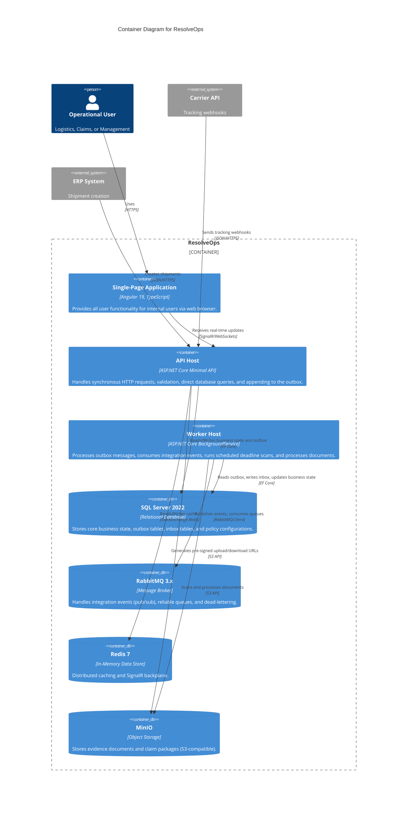

# C4 Container Diagram

```mermaid
C4Container
    title Container Diagram for ResolveOps
    
    Person(user, "Operational User", "Logistics, Claims, or Management")
    System_Ext(carrier, "Carrier API", "Tracking webhooks")
    System_Ext(erp, "ERP System", "Shipment creation")
    
    Container_Boundary(resolveOps, "ResolveOps") {
        Container(spa, "Single-Page Application", "Angular 19, TypeScript", "Provides all user functionality for internal users via web browser.")
        
        Container(api, "API Host", "ASP.NET Core Minimal API", "Handles synchronous HTTP requests, validation, direct database queries, and appending to the outbox.")
        Container(worker, "Worker Host", "ASP.NET Core BackgroundService", "Processes outbox messages, consumes integration events, runs scheduled deadline scans, and processes documents.")
        
        ContainerDb(sqlServer, "SQL Server 2022", "Relational Database", "Stores core business state, outbox tables, inbox tables, and policy configurations.")
        ContainerDb(rabbitMq, "RabbitMQ 3.x", "Message Broker", "Handles integration events (pub/sub), reliable queues, and dead-lettering.")
        ContainerDb(redis, "Redis 7", "In-Memory Data Store", "Distributed caching and SignalR backplane.")
        ContainerDb(minio, "MinIO", "Object Storage", "Stores evidence documents and claim packages (S3-compatible).")
    }
    
    Rel(user, spa, "Uses", "HTTPS")
    Rel(spa, api, "Makes API calls", "JSON/HTTPS")
    Rel(spa, api, "Receives real-time updates", "SignalR/WebSockets")
    
    Rel(carrier, api, "Sends tracking webhooks", "JSON/HTTPS")
    Rel(erp, api, "Creates shipments", "JSON/HTTPS")
    
    Rel(api, sqlServer, "Reads/Writes business state and outbox", "EF Core")
    Rel(api, minio, "Generates pre-signed upload/download URLs", "S3 API")
    Rel(api, redis, "Reads/Writes cache", "StackExchange.Redis")
    
    Rel(worker, sqlServer, "Reads outbox, writes inbox, updates business state", "EF Core")
    Rel(worker, rabbitMq, "Publishes events, consumes queues", "RabbitMQ.Client")
    Rel(worker, minio, "Scans and processes documents", "S3 API")
```
