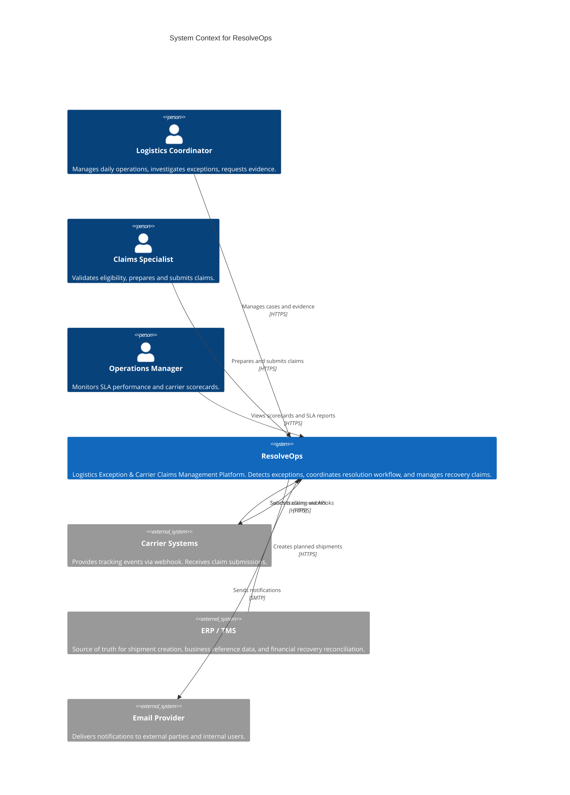

# C4 Context Diagram

```mermaid
C4Context
    title System Context for ResolveOps
    
    Person(logisticsCoordinator, "Logistics Coordinator", "Manages daily operations, investigates exceptions, requests evidence.")
    Person(claimsSpecialist, "Claims Specialist", "Validates eligibility, prepares and submits claims.")
    Person(operationsManager, "Operations Manager", "Monitors SLA performance and carrier scorecards.")
    
    System(resolveOps, "ResolveOps", "Logistics Exception & Carrier Claims Management Platform. Detects exceptions, coordinates resolution workflow, and manages recovery claims.")
    
    System_Ext(carrierSystem, "Carrier Systems", "Provides tracking events via webhook. Receives claim submissions.")
    System_Ext(erpSystem, "ERP / TMS", "Source of truth for shipment creation, business reference data, and financial recovery reconciliation.")
    System_Ext(emailProvider, "Email Provider", "Delivers notifications to external parties and internal users.")
    
    Rel(logisticsCoordinator, resolveOps, "Manages cases and evidence", "HTTPS")
    Rel(claimsSpecialist, resolveOps, "Prepares and submits claims", "HTTPS")
    Rel(operationsManager, resolveOps, "Views scorecards and SLA reports", "HTTPS")
    
    Rel(carrierSystem, resolveOps, "Sends tracking webhooks", "HTTPS")
    Rel(erpSystem, resolveOps, "Creates planned shipments", "HTTPS")
    
    Rel(resolveOps, carrierSystem, "Submits claims via API", "HTTPS")
    Rel(resolveOps, emailProvider, "Sends notifications", "SMTP")
```
