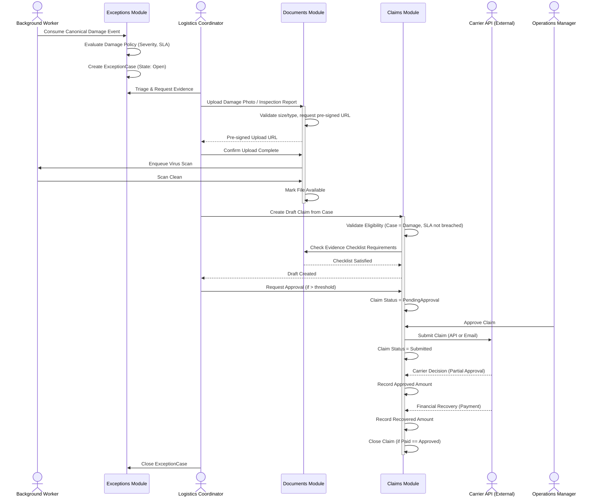

# Damage Claim Sequence

> Shows the end-to-end lifecycle from an exception detection to a resolved claim.

```mermaid
sequenceDiagram
    actor Worker as Background Worker
    participant Exceptions as Exceptions Module
    actor User as Logistics Coordinator
    participant Docs as Documents Module
    participant Claims as Claims Module
    actor Carrier as Carrier API (External)
    
    Worker->>Exceptions: Consume Canonical Damage Event
    Exceptions->>Exceptions: Evaluate Damage Policy (Severity, SLA)
    Exceptions->>Exceptions: Create ExceptionCase (State: Open)
    
    User->>Exceptions: Triage & Request Evidence
    User->>Docs: Upload Damage Photo / Inspection Report
    activate Docs
    Docs->>Docs: Validate size/type, request pre-signed URL
    Docs-->>User: Pre-signed Upload URL
    User->>Docs: Confirm Upload Complete
    Docs->>Worker: Enqueue Virus Scan
    Worker->>Docs: Scan Clean
    Docs->>Docs: Mark File Available
    deactivate Docs
    
    User->>Claims: Create Draft Claim from Case
    activate Claims
    Claims->>Claims: Validate Eligibility (Case = Damage, SLA not breached)
    Claims->>Docs: Check Evidence Checklist Requirements
    Docs-->>Claims: Checklist Satisfied
    Claims-->>User: Draft Created
    
    User->>Claims: Request Approval (if > threshold)
    Claims->>Claims: Claim Status = PendingApproval
    
    actor Manager as Operations Manager
    Manager->>Claims: Approve Claim
    Claims->>Carrier: Submit Claim (API or Email)
    Claims->>Claims: Claim Status = Submitted
    
    Carrier-->>Claims: Carrier Decision (Partial Approval)
    Claims->>Claims: Record Approved Amount
    
    Carrier-->>Claims: Financial Recovery (Payment)
    Claims->>Claims: Record Recovered Amount
    Claims->>Claims: Close Claim (if Paid == Approved)
    deactivate Claims
    
    User->>Exceptions: Close ExceptionCase
```
