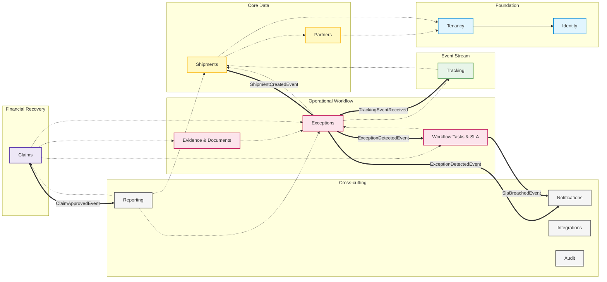

# Module Dependency Diagram

> This diagram shows the directed dependencies between vertical modules in the monolith.
> Communication flows left-to-right via synchronous C# abstractions, or decoupled via Integration Events.

