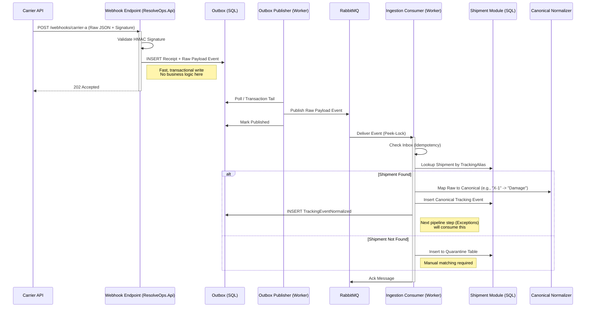

# Tracking Ingestion Sequence

> Shows how an unreliable external webhook is converted to a durable, idempotent canonical event.

```mermaid
sequenceDiagram
    participant Carrier as Carrier API
    participant Webhook as Webhook Endpoint (ResolveOps.Api)
    participant Outbox as Outbox (SQL)
    participant Worker as Outbox Publisher (Worker)
    participant Rabbit as RabbitMQ
    participant Consumer as Ingestion Consumer (Worker)
    participant Shipments as Shipment Module (SQL)
    participant Normalizer as Canonical Normalizer

    Carrier->>Webhook: POST /webhooks/carrier-a (Raw JSON + Signature)
    activate Webhook
    Webhook->>Webhook: Validate HMAC Signature
    Webhook->>Outbox: INSERT Receipt + Raw Payload Event
    Note right of Webhook: Fast, transactional write<br/>No business logic here
    Webhook-->>Carrier: 202 Accepted
    deactivate Webhook

    Worker->>Outbox: Poll / Transaction Tail
    Worker->>Rabbit: Publish Raw Payload Event
    Worker->>Outbox: Mark Published

    Rabbit->>Consumer: Deliver Event (Peek-Lock)
    activate Consumer
    Consumer->>Consumer: Check Inbox (Idempotency)
    Consumer->>Shipments: Lookup Shipment by TrackingAlias
    
    alt Shipment Found
        Consumer->>Normalizer: Map Raw to Canonical (e.g., "X-1" -> "Damage")
        Consumer->>Shipments: Insert Canonical Tracking Event
        Consumer->>Outbox: INSERT TrackingEventNormalized
        Note right of Consumer: Next pipeline step (Exceptions)<br/>will consume this
    else Shipment Not Found
        Consumer->>Shipments: Insert to Quarantine Table
        Note right of Consumer: Manual matching required
    end
    
    Consumer->>Rabbit: Ack Message
    deactivate Consumer
```
